# 2026–27 NBA Forecasting Architecture Rebuild

**Status:** Proposed architecture and implementation roadmap  
**Scope:** Pure-Python CLI; local CSV/Parquet/JSON/model artifacts; no required server, database, or Docker  
**Primary objective:** Produce materially better, auditable NBA player-stat forecasts for the 2026–27 season  
**Prepared from:** Direct review of the repository, current configuration, tests, data, and saved model artifacts on 2026-07-10

---

## 1. Executive decision

Do not begin by adding another large neural network.

The biggest accuracy opportunity is to rebuild the system around a strict **pregame, point-in-time forecast contract** and a realistic chain of uncertainty:

1. Who is on the roster and available?
2. Who starts and plays?
3. How are the team’s 240 regulation minutes allocated?
4. What role and per-minute rates does each player have under that lineup?
5. How do the two teams’ pace, possessions, and player outcomes interact?
6. How well calibrated are the resulting distributions at the actual forecast cutoff?

The current repository already has useful components—modular feature groups, CatBoost models, quantile models, simulation, artifact contracts, a prediction ledger, residual correction, drift detection, and version stores. The rebuild should preserve those useful ideas but reorganize them around one canonical forecast path and one trustworthy evaluation path.

The recommended target stack is:

- A point-in-time data layer with immutable source snapshots and provenance.
- A canonical `ForecastFrame` that creates a synthetic row for the scheduled game.
- Separate availability, minutes, and conditional stat-rate models.
- CatBoost as the strong tabular baseline and likely initial champion.
- A multi-task temporal model only as a challenger after the baseline is trustworthy.
- Direct probabilistic outputs plus conformal calibration.
- A coherent rotation/team simulation that samples availability and minutes before stats.
- Rolling-origin replay evaluation with lead-time-specific scorecards.
- Champion/challenger promotion using paired evidence and atomic artifact bundles.

This is a rebuild of the **forecasting architecture**, not a rewrite for its own sake. The CLI and local-artifact operating model can remain.

---

## 2. What “smarter” means

For this project, smarter must be measurable. A smarter 2026–27 system should:

- Beat simple rolling and per-minute baselines on unseen rolling-origin windows.
- Improve minutes and availability accuracy, not only conditional box-score accuracy.
- Produce calibrated 50%, 80%, and 90% intervals.
- Preserve accuracy across starters, bench players, recent trades, role changes, injury returns, and cold starts.
- Reproduce exactly what was knowable at a named pregame cutoff.
- Record every prediction before the game and reconcile it without overwriting it.
- Explain which model, data snapshot, features, and calibration artifacts produced a forecast.
- Reject a more complicated candidate unless it demonstrates statistically credible out-of-sample improvement.

The main product should be a **forecast distribution**, not a point estimate with noise added afterward.

---

## 3. Current architecture: useful foundations

The repository is not starting from zero. These pieces should be retained or evolved:

- `FeatureGroup` modules and the feature registry provide modularity and extension isolation.
- CatBoost per target is a good tabular NBA baseline.
- Quantile CatBoost models establish a probabilistic path.
- The Transformer provides a temporal challenger, even though its current evaluation/runtime parity needs work.
- The simulation layer already separates phase, possession, correlation, role, four-factor, and context concepts.
- Artifact and projection contracts are present.
- Versioned blend weights, champion/challenger utilities, a prediction ledger, drift detection, and residual monitoring are under active development.
- Tests include many future-row mutation checks for individual feature groups.
- The codebase has explicit degraded-input health reporting instead of silently pretending every source is healthy.

The plan therefore favors **consolidation and correction** before wholesale replacement.

---

## 4. Audit findings

### 4.1 P0: current-game team box scores enter the saved feature schema

`DataLoader.merge_datasets()` joins the current game’s team totals to every player row and creates columns such as `PTS_TEAM`, `REB_TEAM`, `AST_TEAM`, `FGA_TEAM`, and `TOV_TEAM` (`src/preprocessing/data_loader.py`, around lines 135–157).

The feature selector accepts any numeric column containing the keyword `_TE`, which was intended to retain target-encoding fields (`src/utils/prediction_utils.py`, around lines 251–275 and 337–350). `_TEAM` contains `_TE`, so current-game team results pass the name-based safety filter.

The current saved `models/feature_schema.pkl` contains eight raw current-game `*_TEAM` columns. This is target leakage. Any current score, validation score, feature importance, blend weight, residual model, or promotion result built from this schema must be considered untrusted until retrained after the leak is removed.

**Required correction:**

- Replace substring safety with registered exact output columns or anchored patterns.
- Tag feature provenance and availability time; do not infer safety from a friendly-looking name.
- Exclude all current-game player and team outcomes before feature engineering.
- Add a hard contract that fails if a feature depends on a row with `event_time >= forecast_cutoff`.
- Retrain every downstream artifact from a clean data snapshot.

### 4.2 P0: the holdout exists but is not scored in the main training command

`TrainingPipeline.prepare_data()` creates fit, validation, and test partitions. `train.py` prints the test size but calls `pipeline.train(fit_df, val_df)` and never evaluates `test_df` before saving the artifacts.

The validation set is therefore used for early stopping and ensemble construction, while the nominal test set does not provide a final untouched scorecard.

**Required correction:** preserve a final outer test window and produce a mandatory evaluation artifact before a candidate can be promoted.

### 4.3 P0: the backtest is not a faithful replay

`BacktestRunner` predicts historical rows using whichever current model bundle is loaded. It does not verify that the model’s training cutoff precedes the tested game. It passes `history_df=None`, so the Transformer path is omitted even when the live stack uses it. It also uses a single feature table computed from the latest available raw files rather than named source snapshots captured at the historical forecast cutoff.

This is a row-scoring utility, not yet a full historical replay system.

**Required correction:** the evaluator must load a bundle with an explicit training cutoff, materialize features as of the historical cutoff, use the exact runtime forecast service, and reject overlapping train/evaluation dates.

### 4.4 P0: live forecasts use a stale historical row rather than a scheduled-game row

`GameSimulator._build_roster_context()` selects each player’s latest completed row and overwrites home/opponent fields. Most rolling features are built with `shift(1)`. On the latest completed row, those fields contain history only through the game before it. Reusing that row for the next game omits the most recently completed game.

It also leaves date-derived fields anchored to the old game unless they are manually overwritten.

**Required correction:** append a synthetic scheduled-game row with the new game ID, date, team, opponent, venue, rest, lineup, and snapshot cutoff; then materialize all features for that row from history strictly before the cutoff.

### 4.5 P0: smart feature selection sees the future test period

In `train.py`, smart feature selection runs on `full_df` before `pipeline.prepare_data()` creates fit/validation/test partitions. The ablation, shadow filtering, permutation importance, and final feature choice can therefore use the future test period.

**Required correction:** put feature selection inside the inner training loop. The outer test window must never influence feature choice, hyperparameters, blending, calibration, or stopping.

### 4.6 P1: availability and participation are not modeled as a first-class target

The game logs mostly describe appearances. The simulator builds a roster from players who appeared recently and applies current injury probabilities. That does not create a historical player-team-game panel containing active, inactive, out, DNP-CD, two-way/G League, and not-on-roster states.

Without those negative rows, the system cannot learn `P(active)`, `P(plays | active)`, or the reasons those probabilities change.

**Required correction:** construct a roster-game participation table by crossing dated roster membership with the team schedule, then attach box-score and status labels.

### 4.7 P1: minutes are central but not part of the main trained bundle

`MinutesPredictor` can train a LightGBM model, but the main training pipeline does not train or version it. `GameSimulator` initializes it separately and usually falls back to heuristics if `models/minutes_model.pkl` is absent. Several training-only context fields are constants, and coach profiles have hardcoded defaults.

The simulation later allocates phase minutes to sum to five players per team, but the upstream player-stat models predict totals without a single explicit conditional minutes contract.

**Required correction:** minutes becomes a required model artifact, with availability conditioning, quantiles, 240-minute constraints, and its own evaluation.

### 4.8 P1: point totals are modeled before opportunity is resolved

The per-target models forecast full-game PTS/REB/AST/STL/BLK/TOV directly. Minutes and lineup adjustments are then applied in simulation through heuristics and normalization. This can double-count context or make the same mean travel through several unrelated adjustments.

**Required correction:** predict conditional rates and allocate opportunity first. For example:

`stat_total = played × minutes × conditional_rate(minutes, role, lineup, opponent)`, with count/stat-specific distributions.

### 4.9 P1: configured recency weighting is not active in CatBoost training

The repository defines temporal weighting utilities and `use_sample_weights`, but active calls to `train_catboost_target()` pass `sample_weight=None`.

**Required correction:** make weighting an explicit, versioned training policy and evaluate it rather than merely configuring it.

### 4.10 P1: runtime prediction logic is duplicated

`ModelManager` and `PredictionService` each implement loading, feature alignment, fallback behavior, Transformer blending, and uncertainty logic. The simulator uses `ModelManager`; other consumers can use `PredictionService`.

**Required correction:** one `ForecastService` owns the production path. CLIs, backtests, simulation, correction training, and queries call it.

### 4.11 P1: data required by enabled features is currently absent

The inspected data directory contains the core player/team CSVs, but no `player_bios.csv`, `injury_history.csv`, or real advanced tracking file. The active saved bundle is the small CatBoost-only preset, with no Transformer artifact, no champion manifest, and no separately trained minutes model.

The current data spans 2024-10-22 through 2026-04-10 and has only about two seasons of game logs. Lifecycle, injury-history, and long-term development claims should therefore be treated as degraded until their source data exists and passes coverage gates.

### 4.12 P2: simulation mixes learned predictions with many fixed heuristics

The simulation contains useful basketball structure, but numerous constants govern roster size, recent-player selection, starter bonuses, injury floors, minutes blending, context boosts, pool rates, shooting bounds, blowout effects, and market blending.

These are reasonable prototypes, but they are not all learned or calibrated from the same replay dataset. Their combined effect is difficult to attribute.

**Required correction:** every adjustment must be either:

- learned from a training window,
- calibrated on an inner validation window,
- declared as a scenario assumption, or
- removed.

### 4.13 P2: artifacts are partly versioned and partly flat

The repository currently mixes flat CBM/joblib/pickle artifacts, versioned blend JSON, residual directories, and an optional champion manifest. Contracts mostly validate file presence, not the semantic compatibility of all artifacts.

**Required correction:** one immutable model bundle manifest must reference every component, its schema hash, data cutoff, configuration hash, metrics, and code version.

---

## 5. Target architecture

```mermaid
flowchart LR
    A["Immutable source snapshots"] --> B["Canonical event and identity tables"]
    B --> C["Point-in-time feature materializer"]
    C --> D["Scheduled-game ForecastFrame"]
    D --> E["Availability and participation model"]
    D --> F["Minutes and rotation model"]
    E --> F
    D --> G["Conditional stat-rate models"]
    F --> G
    E --> H["Joint game simulator"]
    F --> H
    G --> H
    H --> I["Calibration and forecast bundle"]
    I --> J["CLI, CSV reports, probability queries"]
    I --> K["Immutable prediction ledger"]
    K --> L["Postgame reconciliation"]
    L --> M["Rolling-origin evaluation and drift"]
    M --> N["Champion/challenger promotion"]
    N --> I
```



### 5.1 Canonical forecast request

Every prediction begins with an immutable request:

```python
@dataclass(frozen=True)
class ForecastRequest:
    game_id: str
    game_date: date
    home_team_id: int
    away_team_id: int
    forecast_cutoff: datetime
    horizon: str              # e.g. previous_night, morning, pregame_30m
    source_snapshot_id: str
    model_bundle_id: str
    scenario: str = "official"
```

`forecast_cutoff` is not optional. Every joined value must prove `available_at <= forecast_cutoff`.

### 5.2 Canonical forecast output

The output should be long-form and stat-agnostic:

```text
MODEL_BUNDLE_ID, SNAPSHOT_ID, GENERATED_AT, FORECAST_CUTOFF,
GAME_ID, PLAYER_ID, TEAM_ID, OPPONENT_ID, HORIZON,
PLAY_PROB, EXPECTED_MINUTES, MIN_P10, MIN_P50, MIN_P90,
STAT, MEAN, P10, P25, P50, P75, P90,
ZERO_PROB, DATA_QUALITY, CALIBRATION_VERSION, SCENARIO
```

Wide CSVs can still be generated for existing query/report code, but the canonical artifact should be long-form.

---

## 6. Data architecture

### 6.1 Local lake layout

No database is required. Use partitioned Parquet and small JSON manifests:

```text
data/
  raw/
    nba_game_logs/snapshot_date=YYYY-MM-DD/*.parquet
    rosters/snapshot_date=YYYY-MM-DD/*.parquet
    injuries/snapshot_date=YYYY-MM-DD/*.parquet
    lineups/snapshot_date=YYYY-MM-DD/*.parquet
    odds/snapshot_date=YYYY-MM-DD/*.parquet
  canonical/
    games/season=2026-27/*.parquet
    player_games/season=2026-27/*.parquet
    roster_membership/season=2026-27/*.parquet
    availability_events/season=2026-27/*.parquet
    source_snapshots/*.json
  features/
    feature_set=<hash>/season=2026-27/*.parquet
  evaluation/
    predictions/*.parquet
    actuals/*.parquet
    scorecards/*.json
```

### 6.2 Required canonical tables

1. `games`: one row per game, schedule and final result separated.
2. `team_games`: two rows per game, only pregame fields in the forecast view.
3. `player_games`: one row per appearance and final box score.
4. `roster_membership`: player/team effective date ranges.
5. `player_team_games`: one row for every rostered player and scheduled game, including non-appearances.
6. `availability_events`: status, reason, source, observed time, effective game.
7. `lineup_snapshots`: projected/confirmed starters with observation time.
8. `odds_snapshots`: market values with book/source and observation time.
9. `player_bios`: effective-dated identity, position, measurements, experience.
10. `source_snapshot_manifest`: hashes, row counts, coverage, freshness, and fetch errors.

### 6.3 Data contracts

Each canonical table must declare:

- Primary key and duplicate policy.
- Event time and observation time.
- Source and source priority.
- Required columns and dtypes.
- Valid ranges and null policy.
- Join cardinality.
- Freshness expectation.
- Whether a field is allowed at each forecast horizon.

Hard-fail training on key duplication, impossible minutes, malformed dates, team-game counts other than two, or current/future outcomes in forecast views.

### 6.4 Identity resolution

Use NBA IDs as the canonical player/team keys. Names are display fields, never join keys. Add alias tables only for sources without IDs. Roster transactions must be effective-dated so a recent trade cannot rewrite historical team membership.

### 6.5 Historical snapshot policy

The current injury/lineup/odds caches are useful for today but insufficient for replay. Every game-day fetch should append a timestamped snapshot. Never replace yesterday’s file with today’s value.

Define three official forecast horizons:

- `previous_night`: suitable for fantasy planning and stable historical coverage.
- `morning`: includes morning injury reports and early markets.
- `pregame_30m`: includes confirmed lineups where available.

Train and score horizon-specific context because the available information differs materially.

---

## 7. Feature architecture

### 7.1 Replace name safety with provenance safety

Each feature declares metadata:

```python
@dataclass(frozen=True)
class FeatureSpec:
    name: str
    group: str
    dtype: str
    entity_keys: tuple[str, ...]
    event_time_column: str
    max_lookback_days: int | None
    required_sources: tuple[str, ...]
    allowed_horizons: tuple[str, ...]
    missing_policy: str
    version: str
```

The materializer emits only registered `FeatureSpec` outputs. There is no substring allow-list.

### 7.2 `ForecastFrame` materialization

Create `src/features/materializer.py` with two entry points:

- `materialize_training_examples(requests, snapshot_store)`
- `materialize_forecast(request, snapshot_store)`

Both call the same feature DAG. A training example is simply a historical `ForecastRequest` whose label becomes available later.

### 7.3 Leakage test standard

For every feature and full feature set:

1. Materialize game G at cutoff T.
2. Mutate all raw rows with event or observation time after T.
3. Re-materialize G.
4. Assert byte-equivalent feature values.

Also test that removing the latest completed game changes the next scheduled row as expected. This catches the live stale-row problem.

### 7.4 Feature families to prioritize

- Minutes and rotation stability: start rate, closing rate, coach rotation width, substitution volatility.
- Per-minute and per-possession stat rates with empirical Bayes shrinkage.
- On/off and teammate-absence effects estimated with regularization, not raw small-sample splits.
- Expected role: starter, primary creator, secondary creator, spacer, rim big, bench scorer.
- Opponent scheme/position matchup from prior data only.
- Travel, rest, altitude, time-zone, and schedule density.
- Team pace and possession expectations.
- Availability confidence and report age.
- Trade/team-change and coach-change flags.
- Rookie/cold-start priors based on role, age, draft/league history, and position—not a global average.

Synthetic “advanced tracking” derived from the same box score must not be described or evaluated as independent tracking signal. Keep it as an example extension only or replace it with a real source.

---

## 8. Modeling architecture

### 8.1 Stage A: availability and participation

Predict:

- `P(active)`
- `P(plays | active)`
- `P(starts | plays)`

Use calibrated CatBoost classification first. Labels require the new roster-game panel. Evaluate log loss, Brier score, calibration error, and recall on late scratches.

Availability should be sampled once per simulation and shared by all downstream player stats.

### 8.2 Stage B: minutes and rotation

Predict a conditional minutes distribution, not a single heuristic mean:

- Quantiles or a bounded distribution for `MIN | plays`.
- Starter/bench mixture where appropriate.
- Team-level constrained allocation totaling 240 regulation minutes.
- Overtime minutes handled by the game simulator, not training labels mixed into regulation allocation.

Start with CatBoost quantile models. Add a team rotation allocator that projects raw player quantiles onto roster constraints while preserving rank and uncertainty.

### 8.3 Stage C: conditional stat rates

Predict rates conditional on playing time and role:

- PTS: scoring opportunity and efficiency components or points per minute.
- REB/AST/TOV: per-minute or per-possession count rates.
- STL/BLK: zero-inflated count models with strong shrinkage.

CatBoost remains the first champion. Train one model per target or a small number of logically related heads. Include predicted minutes as an out-of-fold feature; never use actual same-game minutes at forecast time.

### 8.4 Stage D: probabilistic outputs

Use direct quantiles or distribution parameters, then calibrate on held-out rolling windows.

Recommended progression:

1. CatBoost mean + quantile models.
2. Isotonic/quantile mapping by stat and minutes band.
3. Split-conformal or adaptive conformal intervals by horizon.
4. A multi-output distributional neural challenger if it beats the baseline.

Do not derive every standard deviation from a fixed `(P90-P10)/2.56` assumption when zero inflation, skew, and discrete counts are present.

### 8.5 Stage E: temporal challenger

Once the point-in-time baseline is stable, replace or refactor the current Transformer into a multi-task challenger:

- Sequence contains only prior games and explicit time gaps.
- Static embeddings: player, team, opponent, role/archetype.
- Outputs: minutes quantiles and conditional stat distribution parameters.
- Missing-history mask replaces ambiguous all-zero padding.
- Train with player-balanced sampling so high-appearance veterans do not dominate.
- Evaluate its incremental value against CatBoost on the same replay rows.

The Transformer is optional in production. It earns nonzero ensemble weight only through out-of-fold predictions.

### 8.6 Ensemble policy

Replace inverse validation MAE and in-sample ridge stacking with out-of-fold stacking:

- Generate predictions from rolling inner folds.
- Fit a constrained nonnegative meta-learner per target/horizon.
- Include simple baselines as candidate experts.
- Use shrinkage toward the best single model.
- Refit base models after weights are locked.
- Store fold predictions with the bundle.

Residual correction should become either a documented stacking/calibration stage trained entirely on out-of-fold residuals or be removed. It must not silently correct predictions from rows used to train the base model.

### 8.7 Cold starts

Create explicit fallback tiers:

1. Player current-season posterior.
2. Player previous-season posterior adjusted for age/team/role.
3. Similar-role hierarchical prior.
4. Rookie/league-transition prior.
5. League role prior.

Every forecast records which tier was used. Hardcoded global stat averages become the last emergency tier only.

---

## 9. Simulation architecture

### 9.1 Correct simulation order

For each game simulation:

1. Sample active/inactive states from the availability model with report certainty.
2. Sample starters/rotation state.
3. Sample regulation minutes jointly and enforce team totals.
4. Sample game pace, possessions, and team scoring environment.
5. Sample player role/usage conditional on the active lineup.
6. Sample player stat rates and totals.
7. Enforce basketball coherence constraints.
8. Simulate overtime only when the sampled regulation game is tied/near the overtime mechanism.

### 9.2 Coherence constraints

At minimum:

- Team regulation minutes sum to 240.
- Player minutes remain in `[0, 48]` before overtime.
- Team player points sum to team points.
- Assists cannot exceed made field goals by an impossible amount.
- Team rebounds relate to missed shots and available rebound opportunities.
- Player stats are zero when the player does not play.
- Availability, minutes, and stat outcomes share the same sampled scenario.

### 9.3 Market information

Treat betting lines as an optional model input and report two scorecards:

- `model_only`
- `market_assisted`

This prevents market blending from hiding whether the basketball model improved. Market snapshots must be timestamped and matched to the forecast horizon.

### 9.4 Remove double adjustment

Today, means can be changed by the base model, residual correction, defensive adjustment, context engine, four-factor blend, betting calibration, correlation normalization, and phase simulation. The rebuild should have one documented transformation graph. Each stage records pre/post values and is ablated in replay.

---

## 10. Evaluation architecture

### 10.1 Rolling-origin outer evaluation

Use expanding or sliding training windows and untouched future blocks:

```text
Fold 1: train through Dec 15 -> evaluate Dec 16–31
Fold 2: train through Dec 31 -> evaluate Jan 1–15
Fold 3: train through Jan 15 -> evaluate Jan 16–31
...
```

Use a small embargo around cutoffs if any source is finalized after games. Feature selection, hyperparameters, blending, and calibration run only inside each fold’s training history.

### 10.2 Required baselines

- Last-5 mean.
- Last-10 exponentially weighted mean.
- Expected minutes × shrunk per-minute rate.
- Season-to-date role mean.
- CatBoost mean model with core features.
- Market-implied team total where available, reported separately.

A complex model that cannot beat these across repeated windows does not ship.

### 10.3 Metrics

| Component | Primary metrics | Secondary metrics |
|---|---|---|
| Availability | log loss, Brier | ECE, late-scratch recall |
| Minutes | MAE, CRPS/WIS | quantile loss, interval coverage |
| Stat means | MAE by stat | RMSE, bias, Spearman |
| Stat distributions | CRPS/WIS | 50/80/90 coverage, sharpness |
| Threshold probabilities | Brier | log loss, calibration curves |
| Team simulation | total/spread MAE | distribution coverage |
| Runtime | batch latency | memory, cache hit rate |

Do not aggregate raw PTS, STL, and BLK errors into one unnormalized overall MAE. Use per-stat metrics and an explicitly documented normalized business score.

### 10.4 Mandatory slices

- Forecast horizon.
- Starter/bench/low-minutes.
- Predicted minutes bands.
- Injury status and days since return.
- New team/recent trade.
- Rookie/cold start.
- Home/away and rest bucket.
- Early season, trade deadline, late season, postseason.
- Full vs degraded data quality.
- Model fallback tier.

### 10.5 Replay output

Every evaluation row stores:

- Request and cutoff.
- Snapshot and bundle IDs.
- Features/schema hash.
- Component predictions.
- Final distribution.
- Actual outcome.
- Data quality and fallback tier.

This becomes the one dataset used by calibration, residual analysis, drift, and promotion.

---

## 11. Artifact and lifecycle architecture

### 11.1 Immutable bundle

```text
models/versions/<bundle_id>/
  manifest.json
  config.yaml
  feature_schema.json
  data_manifest.json
  availability/
  minutes/
  stat_rates/
  temporal_challenger/
  ensemble/
  calibration/
  simulation/
  metrics/
  oof_predictions.parquet
```

`manifest.json` includes:

- Bundle ID and parent.
- Training data range and maximum label date.
- Source snapshot hashes.
- Git commit/tree state or source hash.
- Python/package versions.
- Random seeds.
- Feature set and config hashes.
- Component artifact checksums.
- Outer evaluation metrics and slices.
- Promotion decision and approver/mode.

### 11.2 Champion pointer

Keep the current atomic `champion.json` concept, but make it the only production pointer. `ModelManager` should never combine components from the flat root and a version directory.

### 11.3 Prediction ledger

Extend the existing ledger key to include forecast horizon and scenario:

`(model_bundle_id, snapshot_id, game_id, player_id, stat, horizon, scenario)`.

Append-only means a later pregame refresh is a new snapshot, not a duplicate silently discarded. Actuals are reconciled in separate columns or a separate actuals table.

### 11.4 Promotion gates

A candidate is eligible only if:

- No contract or leakage test fails.
- It was scored on paired, non-overlapping replay rows.
- Minimum sample size is met per stat and important slice.
- The primary normalized score improves by the configured threshold.
- The paired bootstrap lower bound is positive.
- No core target or safety slice exceeds its regression limit.
- Calibration and data-quality behavior do not regress.
- Runtime stays within budget.

The existing continual-learning and model-versioning code can evolve into this gate rather than being discarded.

---

## 12. Proposed package layout

```text
src/
  domain/
    ids.py
    forecast_request.py
    forecast_output.py
  data/
    sources/                 # source-specific clients
    snapshots.py             # immutable snapshot writer/reader
    canonicalize.py
    contracts.py
    identity.py
  features/
    specs.py
    registry.py
    materializer.py
    groups/
  forecasting/
    service.py               # only production forecast path
    availability.py
    minutes.py
    stat_rates.py
    ensemble.py
    calibration.py
    fallbacks.py
  simulation/
    game.py
    rotation.py
    possessions.py
    coherence.py
    scenarios.py
  evaluation/
    replay.py
    folds.py
    baselines.py
    metrics.py
    slices.py
    ledger.py
    promotion.py
  artifacts/
    manifest.py
    registry.py
    contracts.py
  cli/
    update_data.py
    train.py
    forecast.py
    evaluate.py
    promote.py
```

Keep root CLI wrappers for backward compatibility while they delegate to `src/cli/`.

---

## 13. Current-to-target migration map

| Current area | Target action |
|---|---|
| `src/preprocessing/data_loader.py` | Split canonical joins from point-in-time forecast views; never merge current outcomes into features. |
| `src/utils/prediction_utils.py::FeatureSelector` | Replace naming heuristics with `FeatureSpec` registry and exact schema. |
| `src/preprocessing/feature_engineer*.py` | Wrap existing groups behind one point-in-time materializer; retire duplicate CPU/GPU semantics over time. |
| `src/training/pipeline.py` | Make nested rolling splits, OOF predictions, final test scoring, and bundle writing mandatory. |
| `src/models/model_manager.py` | Shrink into artifact loading; move prediction orchestration to `ForecastService`. |
| `src/pipeline/prediction_service.py` | Merge into `ForecastService`; remove duplicated ensemble logic. |
| `src/models/minutes_predictor.py` | Rebuild as a required, versioned probabilistic minutes component. |
| `src/evaluation/backtest_runner.py` | Replace with point-in-time `ReplayEvaluator`; keep a compatibility wrapper. |
| `src/simulation/game_simulator.py` | Split orchestration, rotation, sampling, and coherence; eliminate repeated mean adjustments. |
| `src/correction/` | Retain only if trained on OOF residuals and it wins replay ablation. |
| `src/reasoning/` | Consume forecast traces; never influence predictions unless explicitly evaluated as a model stage. |
| `src/contracts/` | Expand from file presence/schema checks to semantic bundle and cutoff contracts. |
| `update_data.py` | Become a snapshot orchestrator; source clients write raw immutable outputs. |
| `train.py` | Delegate to a reproducible experiment/bundle builder. |
| `simulate_season.py` | Become `forecast` orchestration using the same service as replay. |

---

## 14. Phased implementation plan

Estimates assume one focused developer and are sequencing guides, not deadlines.

### Phase 0 — quarantine and clean baseline (2–4 days)

**Tasks**

1. Add all current-game `*_TEAM` totals to an explicit forbidden set immediately.
2. Replace `_TE` substring matching with an anchored target-encoding naming rule.
3. Add a test that the current saved leak pattern can never enter a schema.
4. Move smart feature selection after the outer split and run it only on fit/inner validation.
5. Score and save the untouched test set.
6. Add `training_cutoff` to model metadata and make backtest reject overlap.
7. Mark all existing model metrics and blend/residual artifacts as pre-clean-baseline.

**Exit gate**

- No forbidden current-game columns in the feature schema.
- Full future-row mutation test passes.
- Clean CatBoost baseline trained and evaluated on a truly unseen window.

### Phase 1 — immutable data and forecast contract (1–2 weeks)

**Tasks**

1. Implement source snapshot manifests and timestamped Parquet writes.
2. Define canonical games, player-games, roster membership, availability, lineup, odds, and bio schemas.
3. Build identity and transaction handling.
4. Add source freshness/coverage reports.
5. Backfill whatever historical availability/lineup data is realistically obtainable; label missing horizons honestly.
6. Add `ForecastRequest` and official horizon definitions.

**Exit gate**

- A named historical snapshot can be loaded without reading newer files.
- Every value has source and availability-time provenance.
- Core 2025–26 replay coverage is reported by horizon.

### Phase 2 — canonical feature materialization and one forecast service (1–2 weeks)

**Tasks**

1. Implement synthetic scheduled-game rows.
2. Register existing feature-group outputs as `FeatureSpec`s.
3. Make training and live inference call the same materializer.
4. Create `ForecastService`; route simulation and backtest through it.
5. Remove duplicated blend/fallback paths after parity tests.
6. Add traces with snapshot, feature, component, and bundle IDs.

**Exit gate**

- Historical replay and live forecasts share the same function.
- Adding the latest completed game changes the next forecast row correctly.
- Mutating future raw data cannot change a prior forecast.

### Phase 3 — trustworthy replay and experiment framework (1–2 weeks)

**Tasks**

1. Implement rolling-origin outer folds and inner tuning folds.
2. Add naive and per-minute baselines.
3. Add component/slice metrics and scorecards.
4. Write OOF predictions and immutable replay rows.
5. Enforce training-cutoff and source-cutoff contracts.
6. Connect existing drift and promotion tools to the replay dataset.

**Exit gate**

- One command reproduces a multi-fold baseline scorecard.
- No test fold affects features, feature choice, model tuning, blending, or calibration.
- Model-only and market-assisted metrics are separate.

### Phase 4 — availability and minutes rebuild (2 weeks)

**Tasks**

1. Build the player-team-game roster panel.
2. Train calibrated availability/participation classifiers.
3. Train minutes quantile models conditional on playing.
4. Implement constrained 240-minute rotation allocation.
5. Add late-scratch, injury-return, starter, bench, and low-minute slices.
6. Version availability/minutes artifacts inside the bundle.

**Exit gate**

- Availability beats status/appearance baselines on Brier/log loss.
- Minutes beats rolling-10 and per-role baselines across repeated folds.
- Simulated regulation minutes always satisfy constraints.

### Phase 5 — conditional stat-rate and calibration rebuild (2–3 weeks)

**Tasks**

1. Train per-minute/per-possession CatBoost baselines using OOF predicted minutes.
2. Add target-appropriate distributions and quantiles.
3. Add hierarchical shrinkage for small samples and role changes.
4. Fit horizon/stat/minutes-band calibrators on inner holdouts.
5. Compare direct-total and conditional-rate approaches by replay.
6. Rebuild ensemble weights from OOF predictions.

**Exit gate**

- Conditional pipeline improves the normalized score without unacceptable target regressions.
- 50/80/90 intervals meet coverage tolerances with useful sharpness.
- Probability queries use the calibrated forecast distribution directly.

### Phase 6 — coherent joint simulation (2–3 weeks)

**Tasks**

1. Reorder simulation around availability → minutes → role → possessions → stats.
2. Split the current monolithic `GameSimulator` into testable components.
3. Fit correlations/residual dependence on OOF errors, conditioned on lineup/role where data supports it.
4. Add explicit coherence assertions.
5. Calibrate team totals and player distributions jointly.
6. Ablate or remove fixed adjustments that do not improve replay.

**Exit gate**

- All simulation invariants pass over large randomized runs.
- Simulated marginals match calibrated player forecasts.
- Team/player aggregate scorecards beat the old simulator on untouched games.

### Phase 7 — safe continual learning and season operations (1–2 weeks)

**Tasks**

1. Finalize immutable bundle manifests and checksums.
2. Make the prediction ledger horizon/snapshot-aware.
3. Automate actual reconciliation and daily scorecards.
4. Use existing paired bootstrap and regression gates for promotion.
5. Add drift actions: recalibrate, retune ensemble, retrain component, or full rebuild.
6. Test rollback and corrupted-artifact recovery.

**Exit gate**

- Promotion is atomic and reproducible.
- A bad candidate cannot change the champion pointer.
- Any historical forecast can be traced to exact data and code artifacts.

### Phase 8 — next-generation challenger (only after Phase 5)

Evaluate a multi-task temporal distributional model, such as a masked Transformer/TFT-style encoder or another sequence architecture already supported by PyTorch.

It should share the same requests, features, folds, output contract, and calibration framework. It is a challenger, not a new parallel pipeline.

**Ship criterion:** statistically credible improvement over the clean CatBoost conditional baseline, including calibration and difficult slices.

---

## 15. First ten pull requests

1. **Leak quarantine:** forbid current-game team outputs; anchored feature matching; regression tests.
2. **Outer test evaluation:** score `test_df`, persist clean metrics, record training cutoff.
3. **Selection isolation:** run smart selection only inside training history.
4. **Forecast request:** add horizon/cutoff/snapshot domain objects and schema.
5. **Scheduled row:** materialize the next-game row from the latest complete history.
6. **Runtime unification:** route `ModelManager`/`PredictionService` users through one service.
7. **Replay v2:** exact runtime parity, cutoff enforcement, naive baselines.
8. **Snapshot writer:** immutable injuries/lineups/odds/bios with manifests.
9. **Roster-game panel:** roster membership plus non-appearance labels.
10. **Minutes champion:** train/version/evaluate availability and minutes components.

Each PR should be independently testable and preserve a compatibility path until its replacement is proven.

---

## 16. Configuration design

Use typed, versioned sections and reject unknown keys in strict training mode:

```yaml
architecture_version: 2

forecast:
  horizons: [previous_night, morning, pregame_30m]
  default_horizon: morning
  require_snapshot: true

data:
  snapshot_root: data/raw
  canonical_root: data/canonical
  fail_on_contract_error: true

evaluation:
  fold_days: 14
  min_train_days: 365
  embargo_hours: 12
  baselines: [rolling_5, rolling_10_ewm, minutes_x_rate]
  slices: [horizon, role, minutes_band, injury, trade, data_quality]

models:
  availability:
    type: catboost_classifier
  minutes:
    type: catboost_quantile
    quantiles: [0.1, 0.5, 0.9]
  stat_rates:
    type: catboost
  temporal_challenger:
    enabled: false

calibration:
  method: adaptive_conformal
  coverage: [0.5, 0.8, 0.9]

promotion:
  min_rows_per_target: 1000
  min_weighted_improvement_pct: 1.0
  max_target_regression_pct: 2.0
  require_positive_bootstrap_lower_bound: true
```

Runtime config should select a bundle and scenario, not redefine training-time model structure.

---

## 17. Testing strategy

### Unit tests

- Data contracts, identity mapping, snapshot selection.
- Feature specs and individual feature computations.
- Availability, minutes constraint, distribution, and coherence utilities.
- Bundle manifest and checksum validation.

### Leakage tests

- Full future-mutation invariance.
- Same-game player target exclusion.
- Same-game team result exclusion.
- Historical snapshot cutoff enforcement.
- Feature selection outer-test isolation.
- OOF-only stacking and residual correction.

### Integration tests

- Tiny end-to-end train → bundle → forecast → ledger → reconcile → score.
- Live/replay parity for the same `ForecastRequest`.
- CPU/GPU feature parity within tolerances.
- Champion promotion and rollback.
- Degraded source behavior by horizon.

### Golden replay tests

Maintain a small frozen week with source snapshots and expected schema/metrics ranges. Exact predictions may change with approved bundle versions; contracts and cutoff behavior may not.

### Statistical tests

- Quantile monotonicity.
- Interval coverage tolerance.
- Simulation marginal agreement.
- Paired candidate/champion bootstrap.
- Drift false-positive checks on stationary synthetic data.

### Performance tests

- Feature materialization time per slate.
- Forecast batch latency.
- Simulation throughput at 100, 1,000, and 10,000 runs.
- Peak CPU/GPU memory.

---

## 18. 2026–27 operating playbook

### Preseason

- Backfill and validate 2024–25 and 2025–26 snapshots where available.
- Train clean baselines and freeze the first champion.
- Create rookie, new-team, and coach-change priors.
- Run shadow forecasts during preseason; do not overfit to preseason results.

### Opening month

- Blend prior-season and current-season posteriors with explicit shrinkage.
- Retrain availability/minutes more frequently than deep stat models.
- Monitor cold-start and new-role slices daily.
- Avoid automatic promotion until minimum current-season sample gates are met.

### Daily game-day loop

1. Append new final game data.
2. Reconcile ledger actuals.
3. Capture morning source snapshots.
4. Run data contracts and freshness report.
5. Generate morning forecasts and append ledger rows.
6. Capture pregame snapshots and generate a new horizon-specific forecast.
7. Never overwrite earlier forecasts.

### Weekly loop

- Score rolling windows and calibration.
- Inspect injury, role-change, and data-quality slices.
- Recalibrate if distributions drift but means remain stable.
- Retune ensemble only from OOF/replay rows.
- Train a challenger only when enough new labels exist.

### Trade deadline and playoffs

- Raise role-change uncertainty after trades.
- Use effective-dated rosters and shorter recency windows.
- Treat postseason rotation behavior as a separate regime only after replay proves value.
- Do not rely on hand-coded motivation flags as a substitute for observed rotation changes.

---

## 19. Success criteria

Before calling the rebuild complete:

### Correctness

- Zero forbidden or post-cutoff features in every bundle.
- 100% of production forecasts have snapshot, cutoff, bundle, and schema IDs.
- Training and replay refuse overlapping or unknown cutoffs.
- All simulation coherence invariants pass.

### Accuracy

- Availability and minutes beat their simple baselines on at least three rolling outer folds.
- Each core stat beats its declared baseline, or any exception is explicitly accepted.
- The normalized primary score improves with a positive paired bootstrap lower bound.
- No critical slice exceeds its regression tolerance.

### Calibration

- Empirical interval coverage is within predefined tolerance at 50%, 80%, and 90%.
- Threshold probabilities pass Brier/ECE gates by stat and horizon.

### Operations

- A full slate can be materialized, forecast, simulated, and written within the runtime budget on the target machine.
- Promotion and rollback are atomic.
- A prediction can be reproduced from its ledger keys alone.

Use relative improvement and calibration gates first. Do not invent absolute MAE goals until a clean replay baseline exists.

---

## 20. Risk register

| Risk | Mitigation |
|---|---|
| Historical injury/lineup snapshots are sparse | Score supported horizons honestly; use missingness and confidence; begin immutable collection now. |
| Rebuild scope becomes too large | Deliver phases behind compatibility wrappers and measurable exit gates. |
| More structure hurts point accuracy | Keep simple CatBoost/direct-total baselines and promote only on evidence. |
| Small samples for rare states | Hierarchical shrinkage, broader role groups, minimum sample gates. |
| Market input hides model quality | Separate model-only and market-assisted scorecards. |
| Neural model consumes time without gain | Keep disabled until the clean tabular baseline is stable. |
| Source site changes | Snapshot raw responses, isolate adapters, validate canonical contracts. |
| Current in-progress modules conflict | Integrate ledger/versioning/residual/reasoning work incrementally; do not duplicate it. |
| Disk growth from snapshots | Parquet partitioning, retention policy for raw payloads, keep manifests/checksums permanently. |
| Early-season drift | Prior-season shrinkage and stricter promotion sample gates. |

---

## 21. Decisions and non-goals

### Decisions

- CatBoost remains the first clean champion.
- The project remains a local CLI system.
- Parquet/JSON artifacts are sufficient; a database is not required now.
- Point-in-time replay is the authority for architecture decisions.
- Availability and minutes are separate first-class predictions.
- The simulator consumes calibrated component distributions; it does not invent uncertainty independently.
- Every complex model or heuristic must beat a declared baseline.

### Non-goals for the first rebuild

- Web UI or public API.
- Real-time streaming infrastructure.
- Distributed training platform.
- Reinforcement learning.
- LLM-generated numeric forecasts.
- Adding LSTM/GNN/another foundation model merely to increase model count.
- Depending on paid/proprietary data before the open/local baseline is correct.

---

## 22. Audited baseline snapshot

The following facts describe the repository at the time this plan was written. They are a baseline, not promised production behavior:

- `pytest -m "not slow" -q`: **498 passed, 1 skipped, 7 deselected** in 160.64 seconds, with 305 warnings.
- The test suite contains 506 discovered test functions across 45 test files.
- Core data contains 52,583 player-game rows from 2024-10-22 through 2026-04-10, 686 players, and 2,442 player-log game IDs.
- Team data contains 4,882 team-game rows and 2,441 unique game IDs; every represented game has two team rows.
- The one-game player/team game-ID difference should be resolved by the new canonical data contract.
- `player_bios.csv`, `injury_history.csv`, and `advanced_tracking.csv` were absent from the inspected data directory.
- The active flat model stack reports the `small` preset, CatBoost only, 309 saved features, and no Transformer.
- The active blend weights are 100% CatBoost for every target.
- The versioned blend store has `v0001`, but no `models/champion.json` was present.
- `python check_contracts.py --models-dir models` passed the current file/artifact checks.
- The current schema still contains the eight leaking `*_TEAM` outcome columns described in section 4.1.

The green unit/integration baseline and passing artifact check are valuable, but they do not invalidate the architectural findings. Existing tests focus heavily on individual feature-group future-row behavior and file presence; they do not currently assert that the final saved schema excludes every same-game team outcome or that live and replay paths are semantically identical.

## 23. Immediate recommendation

Start with Phase 0 and do not promote or tune against the current saved schema. The first meaningful deliverable is a **clean, replayed CatBoost baseline** with:

- no current-game team columns,
- an untouched scored test window,
- no feature-selection access to that window,
- a recorded training cutoff,
- a scheduled-game feature row,
- and a backtest that calls the exact live forecast path.

Only after that baseline exists should the project decide whether the Transformer, residual correction, lifecycle/KAN features, smart feature selection, or sophisticated simulator improves next-season forecasts. The answer should come from paired replay evidence, not architectural enthusiasm.

That sequence gives the project the best chance of being genuinely smarter for 2026–27 rather than merely more complicated.
