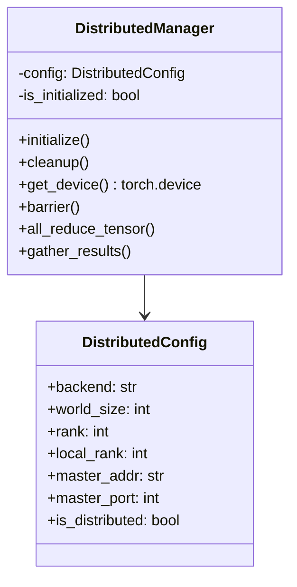
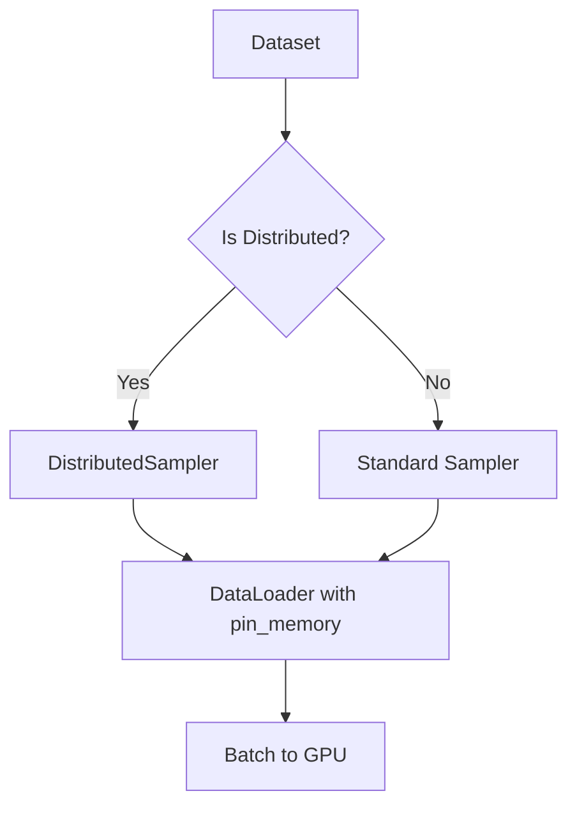
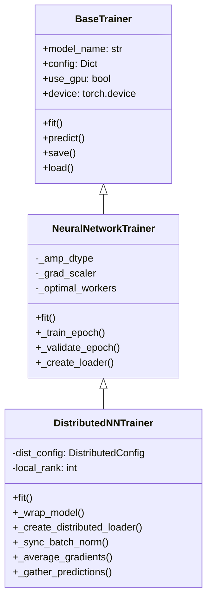
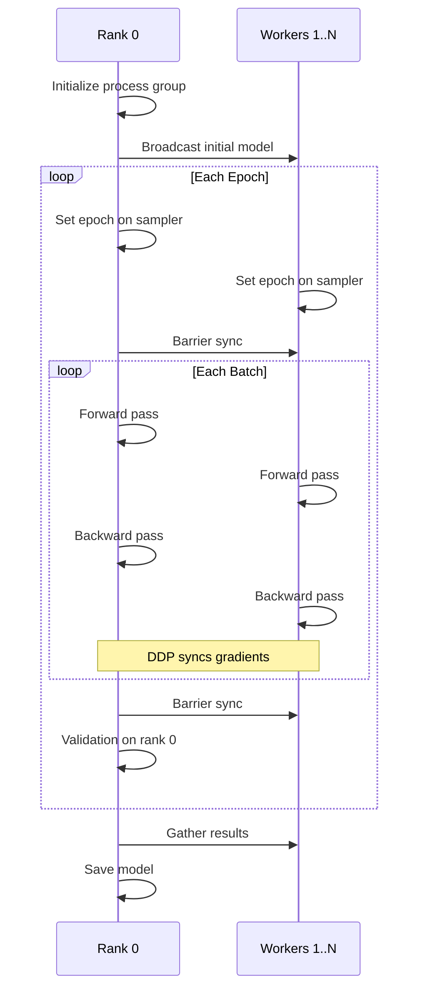

# Distributed Training Implementation Plan

## Overview

This plan outlines the implementation of PyTorch DistributedDataParallel (DDP) support for multi-GPU training across the NBA prediction model training pipeline.

## Current Architecture Analysis

### Existing Components

1. **[`src/training/trainer.py`](src/training/trainer.py)** - Base trainer abstract class with:
   - Device management (`self.device`)
   - GPU flag (`self.use_gpu`)
   - Data validation utilities
   - Metrics computation

2. **[`src/training/nn_trainer.py`](src/training/nn_trainer.py)** - Neural network trainer with:
   - AMP support (BF16/FP16 auto-selection)
   - Gradient accumulation
   - DataLoader optimization
   - `torch.compile` support
   - Rich progress bars

3. **[`src/training/pipeline.py`](src/training/pipeline.py)** - Training orchestrator with:
   - Parallel CatBoost training (joblib)
   - Sequential NN training
   - Feature caching
   - Experiment tracking

4. **[`src/models/gpu_utils.py`](src/models/gpu_utils.py)** - GPU utilities:
   - Device detection
   - Memory management
   - TF32/BF16 support
   - DataLoader worker optimization

### Key Models to Support

- **[`TransformerWrapper`](src/models/transformer_model.py)** - Transformer-based predictor

## Implementation Plan

### Phase 1: Distributed Utilities Module

Create `src/training/distributed.py` with:



**Key Functions:**

1. **Process Group Initialization**
   ```python
   def setup_distributed(
       backend: str = 'nccl',
       init_method: str = 'env://',
       world_size: int = None,
       rank: int = None
   ) -> DistributedConfig
   ```

2. **Environment Setup**
   ```python
   def setup_environment_variables(
       master_addr: str = 'localhost',
       master_port: int = 29500,
       world_size: int = 1,
       rank: int = 0
   ) -> None
   ```

3. **Cleanup**
   ```python
   def cleanup_distributed() -> None
   ```

### Phase 2: Distributed Data Loading

Create `DistributedSampler`-aware data loading:



**Key Components:**

1. **Distributed Sampler Wrapper**
   ```python
   def create_distributed_loader(
       dataset: Dataset,
       batch_size: int,
       num_workers: int,
       rank: int,
       world_size: int,
       shuffle: bool = True,
       pin_memory: bool = True
   ) -> DataLoader
   ```

2. **Data Sharding**
   - Each GPU gets `1/world_size` of the data
   - Proper seeding for reproducibility
   - Handle uneven data splits

### Phase 3: DistributedTrainer Class

Extend `NeuralNetworkTrainer` for DDP:



**Key Modifications:**

1. **Model Wrapping**
   ```python
   def _wrap_model(self, model: nn.Module) -> DDP:
       return DDP(
           model,
           device_ids=[self.local_rank],
           output_device=self.local_rank,
           find_unused_parameters=False,  # Set True if needed
           broadcast_buffers=True
       )
   ```

2. **Batch Normalization Sync**
   ```python
   model = torch.nn.SyncBatchNorm.convert_sync_batchnorm(model)
   ```

3. **Gradient Synchronization**
   - DDP handles this automatically
   - Only need to call `barrier()` at epoch boundaries

### Phase 4: Training Loop Optimization

**Multi-Process Training Loop:**



**Key Optimizations:**

1. **Gradient Accumulation with DDP**
   ```python
   # DDP requires no_sync context for gradient accumulation
   with model.no_sync():
       for _ in range(accumulation_steps - 1):
           loss.backward()
   loss.backward()  # Final step syncs
   ```

2. **Mixed Precision with DDP**
   ```python
   with torch.amp.autocast('cuda', dtype=amp_dtype):
       output = model(input)
       loss = criterion(output, target)
   scaler.scale(loss).backward()
   scaler.step(optimizer)
   ```

3. **Efficient Validation**
   - Only run validation on rank 0
   - Broadcast results to other ranks

### Phase 5: Pipeline Integration

Modify [`TrainingPipeline`](src/training/pipeline.py):

```python
class TrainingPipeline:
    def __init__(
        self,
        ...
        distributed: bool = False,
        world_size: int = 1,
        rank: int = 0,
        ...
    ):
        self.distributed = distributed
        if distributed:
            self.dist_config = setup_distributed(
                world_size=world_size,
                rank=rank
            )
```

**Changes to Training Methods:**

1. **CatBoost Training**
   - CatBoost has native multi-GPU support
   - Use `task_type='GPU'` with `devices='0,1,2,3'`
   - No DDP needed

2. **Neural Network Training**
   - Use `DistributedNNTrainer` when `distributed=True`
   - Single GPU training unchanged for `distributed=False`

### Phase 6: Launch Script

Create `train_distributed.py`:

```python
#!/usr/bin/env python3
"""
Distributed training launch script.

Usage:
    # Single node, 4 GPUs
    torchrun --nproc_per_node=4 train_distributed.py --mode standard
    
    # Multi-node (2 nodes, 4 GPUs each)
    torchrun --nnodes=2 --nproc_per_node=4 \
        --rdzv_id=job1 --rdzv_backend=c10d \
        --rdzv_endpoint=master:29500 \
        train_distributed.py --mode full
"""

import torch.distributed as dist
from torch.nn.parallel import DistributedDataParallel as DDP

def main():
    # Parse arguments
    parser = argparse.ArgumentParser()
    parser.add_argument('--mode', default='standard')
    # ... distributed-specific args
    
    # Initialize distributed
    dist.init_process_group(backend='nccl')
    rank = dist.get_rank()
    world_size = dist.get_world_size()
    
    # Create pipeline with distributed config
    pipeline = create_distributed_pipeline(
        mode=args.mode,
        rank=rank,
        world_size=world_size
    )
    
    # Train
    results = pipeline.train(fit_df, val_df)
    
    # Cleanup
    dist.destroy_process_group()
```

### Phase 7: CLI Arguments

Add to [`train.py`](train.py):

```python
parser.add_argument(
    '--distributed', action='store_true',
    help='Enable distributed training across multiple GPUs'
)
parser.add_argument(
    '--world-size', type=int, default=1,
    help='Number of processes for distributed training'
)
parser.add_argument(
    '--rank', type=int, default=0,
    help='Rank of the current process'
)
parser.add_argument(
    '--dist-backend', type=str, default='nccl',
    choices=['nccl', 'gloo'],
    help='Distributed backend (nccl for GPU, gloo for CPU)'
)
parser.add_argument(
    '--master-addr', type=str, default='localhost',
    help='Master node address for distributed training'
)
parser.add_argument(
    '--master-port', type=int, default=29500,
    help='Master node port for distributed training'
)
```

## File Structure

```
src/training/
├── __init__.py              # Export distributed classes
├── distributed.py           # NEW: Distributed utilities
├── trainer.py               # Base trainer (unchanged)
├── nn_trainer.py            # Modified: Add DDP support
├── pipeline.py              # Modified: Add distributed mode
├── catboost_trainer.py      # Unchanged (native multi-GPU)
└── ...

train.py                     # Modified: Add distributed args
train_distributed.py         # NEW: Launch script

tests/test_training/
├── test_distributed.py      # NEW: Unit tests
└── ...
```

## Implementation Details

### 1. Process Group Initialization

```python
# src/training/distributed.py

import os
import torch
import torch.distributed as dist
from dataclasses import dataclass
from typing import Optional

@dataclass
class DistributedConfig:
    """Configuration for distributed training."""
    world_size: int
    rank: int
    local_rank: int
    backend: str = 'nccl'
    master_addr: str = 'localhost'
    master_port: int = 29500
    
    @property
    def is_main_process(self) -> bool:
        return self.rank == 0
    
    @property
    def is_distributed(self) -> bool:
        return self.world_size > 1


def setup_distributed(
    backend: str = 'nccl',
    init_method: str = 'env://',
    world_size: Optional[int] = None,
    rank: Optional[int] = None,
    master_addr: str = 'localhost',
    master_port: int = 29500,
) -> DistributedConfig:
    """
    Initialize distributed process group.
    
    Args:
        backend: 'nccl' for GPU, 'gloo' for CPU
        init_method: URL to initialize process group
        world_size: Total number of processes
        rank: Rank of current process
        master_addr: Master node address
        master_port: Master node port
    
    Returns:
        DistributedConfig with process group info
    """
    # Get from environment if not specified
    if world_size is None:
        world_size = int(os.environ.get('WORLD_SIZE', 1))
    if rank is None:
        rank = int(os.environ.get('RANK', 0))
    
    local_rank = int(os.environ.get('LOCAL_RANK', 0))
    
    # Set environment variables for init_method='env://'
    os.environ['MASTER_ADDR'] = master_addr
    os.environ['MASTER_PORT'] = str(master_port)
    
    if world_size > 1:
        if not dist.is_initialized():
            dist.init_process_group(
                backend=backend,
                init_method=init_method,
                world_size=world_size,
                rank=rank
            )
    
    return DistributedConfig(
        world_size=world_size,
        rank=rank,
        local_rank=local_rank,
        backend=backend,
        master_addr=master_addr,
        master_port=master_port
    )


def cleanup_distributed():
    """Cleanup distributed process group."""
    if dist.is_initialized():
        dist.destroy_process_group()


def get_device_for_rank(config: DistributedConfig) -> torch.device:
    """Get the appropriate device for the current rank."""
    if torch.cuda.is_available():
        return torch.device(f'cuda:{config.local_rank}')
    return torch.device('cpu')
```

### 2. Distributed Sampler Integration

```python
# src/training/distributed.py (continued)

from torch.utils.data import DataLoader, DistributedSampler
from torch.utils.data import Dataset

def create_distributed_dataloader(
    dataset: Dataset,
    batch_size: int,
    config: DistributedConfig,
    num_workers: int = 4,
    pin_memory: bool = True,
    shuffle: bool = True,
    drop_last: bool = True,
) -> DataLoader:
    """
    Create a DataLoader with DistributedSampler.
    
    Args:
        dataset: PyTorch Dataset
        batch_size: Per-GPU batch size
        config: Distributed configuration
        num_workers: Number of data loading workers
        pin_memory: Whether to pin memory for faster GPU transfer
        shuffle: Whether to shuffle data
        drop_last: Whether to drop last incomplete batch
    
    Returns:
        DataLoader configured for distributed training
    """
    if config.is_distributed:
        sampler = DistributedSampler(
            dataset,
            num_replicas=config.world_size,
            rank=config.rank,
            shuffle=shuffle,
            drop_last=drop_last
        )
        shuffle = False  # Sampler handles shuffling
    else:
        sampler = None
    
    return DataLoader(
        dataset,
        batch_size=batch_size,
        sampler=sampler,
        shuffle=shuffle if sampler is None else False,
        num_workers=num_workers,
        pin_memory=pin_memory,
        drop_last=drop_last,
        persistent_workers=num_workers > 0
    )


def set_epoch_for_sampler(dataloader: DataLoader, epoch: int):
    """Set epoch for DistributedSampler to ensure proper shuffling."""
    if hasattr(dataloader.sampler, 'set_epoch'):
        dataloader.sampler.set_epoch(epoch)
```

### 3. DistributedNNTrainer Class

```python
# src/training/distributed_trainer.py

import torch
import torch.nn as nn
from torch.nn.parallel import DistributedDataParallel as DDP
from typing import Dict, Any, Optional, Union
import logging

from src.training.nn_trainer import NeuralNetworkTrainer
from src.training.distributed import DistributedConfig, get_device_for_rank

logger = logging.getLogger(__name__)


class DistributedNNTrainer(NeuralNetworkTrainer):
    """
    Neural network trainer with DistributedDataParallel support.
    
    Extends NeuralNetworkTrainer to support multi-GPU training using
    PyTorch's DDP. Handles:
    - Process group initialization
    - Model wrapping with DDP
    - DistributedSampler for data sharding
    - Gradient synchronization
    - Metrics aggregation across ranks
    """
    
    def __init__(
        self,
        model_name: str,
        config: Dict[str, Any],
        model_class: type,
        model_kwargs: Dict[str, Any],
        dist_config: DistributedConfig,
        use_amp: bool = True,
        use_compile: bool = False,
        compile_mode: str = 'reduce-overhead',
        gradient_accumulation_steps: int = 1,
        sync_batch_norm: bool = True,
        **kwargs
    ):
        """
        Initialize distributed trainer.
        
        Args:
            dist_config: Distributed training configuration
            sync_batch_norm: Whether to use SyncBatchNorm
            **kwargs: Additional arguments for NeuralNetworkTrainer
        """
        # Get device for this rank
        device = get_device_for_rank(dist_config)
        
        super().__init__(
            model_name=model_name,
            config=config,
            model_class=model_class,
            model_kwargs=model_kwargs,
            use_gpu=True,  # DDP requires GPU
            device=device,
            use_amp=use_amp,
            use_compile=use_compile,
            compile_mode=compile_mode,
            gradient_accumulation_steps=gradient_accumulation_steps,
            **kwargs
        )
        
        self.dist_config = dist_config
        self.sync_batch_norm = sync_batch_norm
        self._is_main_process = dist_config.is_main_process
        
        logger.info(
            f"Initialized DistributedNNTrainer for {model_name} "
            f"(rank={dist_config.rank}/{dist_config.world_size})"
        )
    
    def _build_model(self, input_shape: tuple) -> None:
        """Build and wrap model with DDP."""
        # Create base model on CPU first
        model = self.model_class(**self.model_kwargs)
        
        # Convert to SyncBatchNorm if requested
        if self.sync_batch_norm:
            model = nn.SyncBatchNorm.convert_sync_batchnorm(model)
        
        # Move to device
        model = model.to(self.device)
        
        # Apply torch.compile before DDP wrapping
        if self.use_compile and hasattr(torch, 'compile'):
            try:
                model = torch.compile(model, mode=self.compile_mode)
                logger.info(f"Compiled {self.model_name} with torch.compile")
            except Exception as e:
                logger.warning(f"torch.compile failed: {e}")
        
        # Wrap with DDP
        if self.dist_config.is_distributed:
            self.model = DDP(
                model,
                device_ids=[self.dist_config.local_rank],
                output_device=self.dist_config.local_rank,
                find_unused_parameters=False,
                broadcast_buffers=True
            )
            logger.info(f"Wrapped {self.model_name} with DDP")
        else:
            self.model = model
        
        # Log model size
        param_count = sum(p.numel() for p in self.model.parameters())
        logger.info(f"Built {self.model_name}: {param_count:,} params")
    
    def _create_loader(
        self,
        X: torch.Tensor,
        y: torch.Tensor,
        batch_size: int,
        shuffle: bool,
    ) -> DataLoader:
        """Create DataLoader with DistributedSampler."""
        from src.training.distributed import create_distributed_dataloader
        
        dataset = TensorDataset(X, y)
        
        return create_distributed_dataloader(
            dataset,
            batch_size=batch_size,
            config=self.dist_config,
            num_workers=self._optimal_workers,
            pin_memory=self.use_gpu,
            shuffle=shuffle,
            drop_last=shuffle
        )
    
    def _train_epoch(
        self,
        loader: DataLoader,
        optimizer: torch.optim.Optimizer,
        epoch: int = 0
    ) -> float:
        """Train for one epoch with DDP synchronization."""
        # Set epoch for sampler to ensure proper shuffling
        from src.training.distributed import set_epoch_for_sampler
        set_epoch_for_sampler(loader, epoch)
        
        return super()._train_epoch(loader, optimizer)
    
    def _validate_epoch(self, loader: DataLoader) -> float:
        """Validate with metrics aggregation across ranks."""
        if not self.dist_config.is_distributed:
            return super()._validate_epoch(loader)
        
        # Run validation locally
        local_loss = super()._validate_epoch(loader)
        
        # Aggregate across all ranks
        loss_tensor = torch.tensor([local_loss], device=self.device)
        dist.all_reduce(loss_tensor, op=dist.ReduceOp.SUM)
        avg_loss = loss_tensor.item() / self.dist_config.world_size
        
        return avg_loss
    
    def save(self, path: Union[str, Path]) -> None:
        """Save model only on main process."""
        if self._is_main_process:
            # Unwrap DDP for saving
            model = self.model.module if hasattr(self.model, 'module') else self.model
            state = {
                'model_state': model.state_dict(),
                'config': self.config,
                'model_kwargs': self.model_kwargs,
                'history': self.history,
            }
            joblib.dump(state, path)
            logger.info(f"Saved {self.model_name} to {path}")
    
    def barrier(self):
        """Synchronize all processes."""
        if self.dist_config.is_distributed:
            dist.barrier()
```

### 4. Training Pipeline Modifications

```python
# Add to src/training/pipeline.py

class TrainingPipeline:
    def __init__(
        self,
        ...
        distributed: bool = False,
        world_size: int = 1,
        rank: int = 0,
        master_addr: str = 'localhost',
        master_port: int = 29500,
        ...
    ):
        self.distributed = distributed
        
        if distributed:
            from src.training.distributed import setup_distributed
            self.dist_config = setup_distributed(
                world_size=world_size,
                rank=rank,
                master_addr=master_addr,
                master_port=master_port
            )
        else:
            self.dist_config = None
        
        # ... rest of initialization
    
    def _train_joint_nn_distributed(
        self,
        X_fit: pd.DataFrame,
        X_val: pd.DataFrame,
        fit_df: pd.DataFrame,
        val_df: pd.DataFrame,
    ) -> TrainResult:
        """Train joint NN with distributed support."""
        from src.training.distributed_trainer import DistributedNNTrainer
        
        nn_config = self.model_config['nn']
        numeric_features = [c for c in self.feature_cols if c not in self.cat_features]
        
        trainer = DistributedNNTrainer(
            model_name='joint_nn',
            config=nn_config,
            model_class=MultiOutputNN,
            model_kwargs={
                'input_dim': len(numeric_features),
                'output_dim': len(self.CORE_TARGETS),
                'hidden_dim': nn_config.get('hidden_dim', 512),
                'num_blocks': nn_config.get('num_blocks', 6),
                'dropout': nn_config.get('dropout', 0.3),
            },
            dist_config=self.dist_config,
            use_gpu=self.use_gpu,
            use_amp=nn_config.get('amp', True),
            use_compile=nn_config.get('use_compile', False),
        )
        
        # ... training logic
    
    def cleanup(self):
        """Cleanup distributed resources."""
        if self.distributed:
            from src.training.distributed import cleanup_distributed
            cleanup_distributed()
```

## Testing Strategy

### Unit Tests

```python
# tests/test_training/test_distributed.py

import pytest
import torch
import torch.distributed as dist

class TestDistributedConfig:
    def test_single_process_config(self):
        """Test config for single GPU training."""
        from src.training.distributed import setup_distributed
        
        config = setup_distributed(world_size=1, rank=0)
        
        assert config.world_size == 1
        assert config.rank == 0
        assert not config.is_distributed
        assert config.is_main_process
    
    def test_distributed_config(self):
        """Test config for multi-GPU training."""
        # This test requires torchrun
        pass


class TestDistributedSampler:
    def test_sampler_creates_correct_shards(self):
        """Test that data is properly sharded."""
        pass
    
    def test_epoch_shuffling(self):
        """Test that set_epoch properly shuffles."""
        pass


class TestDistributedNNTrainer:
    @pytest.mark.skipif(not torch.cuda.is_available(), reason="Requires GPU")
    def test_model_wrapped_with_ddp(self):
        """Test that model is properly wrapped."""
        pass
    
    def test_gradient_synchronization(self):
        """Test that gradients are synced across ranks."""
        pass
    
    def test_metrics_aggregation(self):
        """Test that metrics are properly aggregated."""
        pass
```

### Integration Tests

```bash
# Run with torchrun
torchrun --nproc_per_node=2 -m pytest tests/test_training/test_distributed.py -v
```

## Usage Examples

### Single Node, Multi-GPU

```bash
# Using torchrun (recommended)
torchrun --nproc_per_node=4 train.py --mode standard --distributed

# Using Python directly with environment variables
WORLD_SIZE=4 python -m torch.distributed.launch train.py --mode standard
```

### Multi-Node Training

```bash
# Node 0 (master)
torchrun --nnodes=2 --nproc_per_node=4 \
    --rdzv_id=job1 --rdzv_backend=c10d \
    --rdzv_endpoint=10.0.0.1:29500 \
    train.py --mode full --distributed

# Node 1 (worker)
torchrun --nnodes=2 --nproc_per_node=4 \
    --rdzv_id=job1 --rdzv_backend=c10d \
    --rdzv_endpoint=10.0.0.1:29500 \
    train.py --mode full --distributed
```

### Programmatic Usage

```python
from src.training.distributed import setup_distributed, cleanup_distributed
from src.training.distributed_trainer import DistributedNNTrainer
from src.models.transformer_model import TransformerWrapper

# Initialize distributed
config = setup_distributed(world_size=4, rank=rank)

# Create trainer
trainer = DistributedNNTrainer(
    model_name='stats_predictor',
    config={'epochs': 100, 'batch_size': 256},
    model_class=MultiOutputNN,
    model_kwargs={'input_dim': 100, 'output_dim': 3},
    dist_config=config
)

# Train
result = trainer.fit(X_train, y_train, X_val, y_val)

# Cleanup
cleanup_distributed()
```

## Performance Considerations

### 1. Effective Batch Size

With DDP, the effective batch size is `batch_size_per_gpu * world_size`. Adjust learning rate accordingly:

```python
# Scale learning rate with world size
base_lr = 1e-3
scaled_lr = base_lr * world_size
optimizer = torch.optim.AdamW(model.parameters(), lr=scaled_lr)
```

### 2. Gradient Accumulation

For large batch sizes without memory issues:

```python
# Accumulate gradients for effective batch size of batch_size * accumulation_steps
accumulation_steps = 4
for i, (X, y) in enumerate(loader):
    loss = model(X, y) / accumulation_steps
    loss.backward()
    
    if (i + 1) % accumulation_steps == 0:
        optimizer.step()
        optimizer.zero_grad()
```

### 3. NCCL Optimization

```python
# Set NCCL environment variables for optimal performance
os.environ['NCCL_IB_DISABLE'] = '0'  # Enable InfiniBand
os.environ['NCCL_IB_HCA'] = 'mlx5'  # Specify HCA
os.environ['NCCL_DEBUG'] = 'INFO'  # Debug mode
```

## Checklist for Implementation

- [ ] Create `src/training/distributed.py` with:
  - [ ] `DistributedConfig` dataclass
  - [ ] `setup_distributed()` function
  - [ ] `cleanup_distributed()` function
  - [ ] `create_distributed_dataloader()` function
  - [ ] `set_epoch_for_sampler()` function
  - [ ] `get_device_for_rank()` function
  - [ ] `all_reduce_metrics()` utility

- [ ] Create `src/training/distributed_trainer.py` with:
  - [ ] `DistributedNNTrainer` class extending `NeuralNetworkTrainer`
  - [ ] Model wrapping with DDP
  - [ ] SyncBatchNorm conversion
  - [ ] DistributedSampler integration
  - [ ] Metrics aggregation
  - [ ] Main process-only saving

- [ ] Modify `src/training/pipeline.py`:
  - [ ] Add `distributed` parameter
  - [ ] Add `dist_config` attribute
  - [ ] Create `_train_joint_nn_distributed()` method
  - [ ] Add `cleanup()` method

- [ ] Modify `train.py`:
  - [ ] Add distributed CLI arguments
  - [ ] Initialize distributed config
  - [ ] Pass to pipeline

- [ ] Create `train_distributed.py`:
  - [ ] Launch script with torchrun
  - [ ] Argument parsing
  - [ ] Process group management

- [ ] Create `tests/test_training/test_distributed.py`:
  - [ ] Test DistributedConfig
  - [ ] Test sampler sharding
  - [ ] Test DDP wrapping
  - [ ] Test gradient sync

- [ ] Update documentation:
  - [ ] Add distributed training guide to README
  - [ ] Document CLI arguments
  - [ ] Add usage examples

## Dependencies

No new dependencies required. Uses:
- `torch.distributed` (included in PyTorch)
- `torch.nn.parallel.DistributedDataParallel` (included in PyTorch)
- `torch.utils.data.DistributedSampler` (included in PyTorch)
