# NBA Player Forecasting Model v2 — Full Architecture and Remediation Plan

**Status:** Architecture-complete execution specification; implementation readiness is proven only by the evidence gates in this document  
**Prepared:** 2026-08-27  
**Completeness review:** 2026-09-03  
**Target season:** 2026–27 NBA season  
**Operating model:** Pure-Python CLI, local files and model artifacts, optional GPU  
**Primary objective:** Produce pregame NBA player-stat forecasts that reliably beat simple point-in-time baselines and whose probabilities are calibrated, reproducible, and safe to deploy

---

## 0. Executive decision

Do not throw away the repository, and do not try to rescue the current deployed artifact with a normal retrain.

Build **Model v2 inside this repository**. Reuse the parts that already have value—data collectors, feature-group registry, CatBoost trainers, artifact contracts, versioning, CLIs, query/reporting code, and tests—but rebuild the forecasting path around five non-negotiable ideas:

1. Every forecast is tied to an immutable game, cutoff time, source snapshot, and model bundle.
2. Historical evaluation executes the exact same path as a live prediction.
3. Availability and minutes are resolved before full-game player statistics.
4. Every complex model, feature family, ensemble, correction, and simulator adjustment must beat a declared simple baseline on rolling unseen windows.
5. No artifact is deployable unless its data cutoff, code version, feature schema, calibration, metrics, and checksums are known.

The initial champion should be a clean, understandable CatBoost pipeline. Neural sequence models remain challengers until they prove a statistically credible improvement over that champion.

### Decision in one sentence

**Preserve the platform; replace the prediction kernel and evaluation system.**

---

## 1. Verified starting state

This section records the evidence that motivates the plan. It is a baseline, not a claim that the findings are already fixed.

### 1.1 Useful assets worth retaining

- 641 tests are currently collected.
- The non-slow suite passed 634 tests on 2026-08-27.
- The codebase contains modular feature groups, CatBoost and quantile trainers, a Transformer implementation, artifact contracts, bundle versioning, a prediction ledger, residual correction, probability queries, drift tooling, and simulation components.
- The feature safety contract now has a strict `feature_schema_v4` policy.
- A versioned full-stack candidate exists and passes the current artifact contract.
- The repository already has a local-only operating model that is appropriate for this project; a web service, database, Docker stack, and distributed system are not prerequisites for better forecasts.

### 1.2 Findings that invalidate the current deployment

| ID | Finding | Consequence | Required disposition |
|---|---|---|---|
| F-01 | The active flat bundle contains eight current-game team outcomes in its feature schema. | Its metrics and predictions are contaminated by target leakage. | Quarantine permanently; never promote or use as a training teacher. |
| F-02 | The clean full candidate does not materially beat lagged rolling/EMA baselines. | Model complexity has not demonstrated value. | Make simple baselines mandatory promotion competitors. |
| F-03 | The candidate trained on 8,870 fit rows with a 2024-12-21 cutoff, while its outer test runs through 2026-04-10. | It is useful as a long-horizon audit candidate but is stale and undertrained for deployment. | Introduce rolling-origin evaluation, then refit the chosen design through the latest safe cutoff. |
| F-04 | `player_bios.csv`, `injury_history.csv`, and `advanced_tracking.csv` are absent. | Several enabled feature groups emit neutral or zero defaults. | Add coverage gates; disable starved groups until their sources meet coverage thresholds. |
| F-05 | Live simulation can reuse a player’s last completed-game row. | Date, rest, opponent, and shifted features can be stale for the scheduled game. | Materialize a synthetic scheduled-game row for every forecast. |
| F-06 | Feature selection has historically run before the outer split. | The nominal test period can affect chosen features. | Nest all selection and tuning inside training folds only. |
| F-07 | Availability is not modeled as a first-class target. | The system cannot learn late scratches, inactive players, or DNP participation. | Build a player-team-game roster panel and calibrated participation models. |
| F-08 | Minutes are not a required artifact in the main bundle. | Total-stat models conflate opportunity and production. | Make minutes quantiles and constrained team allocation required. |
| F-09 | Full-game totals are predicted before opportunity is resolved. | Later heuristic minutes and context adjustments can double-count effects. | Predict conditional rates after availability and minutes. |
| F-10 | Backtesting is not guaranteed to replay the exact live path from historical snapshots. | Backtest scores may not represent production behavior. | Route live, replay, simulation, and correction through one forecast service. |
| F-11 | Outer-test calibration fields are null and reported uncertainty has zero mean. | Probability and betting outputs are not validated. | Score pinball loss, coverage, sharpness, CRPS, Brier/log loss, and calibration by horizon. |
| F-12 | Simulation mixes learned forecasts with many fixed adjustments. | Effects are hard to attribute and can distort calibrated marginals. | Trace, ablate, learn, declare as scenario-only, or remove every adjustment. |
| F-13 | The active artifact layout is flat, has no champion pointer, and the clean candidate records an unknown code version. | Deployment is not fully reproducible or atomic. | Require immutable bundles and a single atomic champion manifest. |
| F-14 | The working branch is substantially ahead of `main` and has unfinished local edits. | Release state is ambiguous. | Establish an integration branch, clean ownership, and small reviewable pull requests. |
| F-15 | One slow integration test fails with recursive schema extraction on an invalid payload. | The diagnostic artifact path is not release-clean. | Fix in Phase 0 and require both test suites before every promotion. |
| F-16 | Core data currently covers only 2024-10-22 through 2026-04-10. | Deep temporal and lifecycle claims are poorly supported. | Backfill reliable core history and use recency weighting; limit lifecycle claims to supported data. |
| F-17 | A player/team game-ID mismatch remains in the core CSVs. | Canonical joins can silently lose or duplicate a game. | Resolve through canonical table contracts and reconciliation reports. |

### 1.3 Evidence from the clean candidate

The clean candidate’s outer test contains 42,147 player-game rows from 2025-01-01 through 2026-04-10.

The following comparison was computed using only prior player games for each simple predictor:

| Target | Full candidate MAE | Best simple MAE | Relative result |
|---|---:|---:|---:|
| PTS | 4.6917 | 4.6422 | 1.1% worse |
| REB | 1.9396 | 1.9430 | 0.2% better |
| AST | 1.3614 | 1.3588 | 0.2% worse |
| STL | 0.7397 | 0.7220 | 2.5% worse |
| BLK | 0.5425 | 0.5035 | 7.7% worse |
| TOV | 0.8922 | 0.8962 | 0.5% better |

This table is the reason the project must become more evidence-driven. Adding features or another network is not a valid next step until the comparison framework is trustworthy.

---

## 2. Product definition and success criteria

### 2.1 Forecasted outcomes

Model v2 forecasts, for every eligible player and game:

- Probability the player is active.
- Probability the player plays, conditional on being active.
- Expected minutes conditional on playing, plus P10/P50/P90.
- PTS, REB, AST, STL, BLK, and TOV distributions.
- Optional derived markets such as PRA only by sampling or combining the calibrated joint distribution—not by independently summing unrelated probabilities.
- Data-quality and confidence fields tied to the exact sources available at the requested horizon.

### 2.2 Supported forecast horizons

Every forecast must declare one of a small set of official horizons. Initial definitions should be configurable but fixed for evaluation:

| Horizon | Default cutoff | Primary purpose |
|---|---|---|
| `previous_night` | 11:59 p.m. ET on the prior calendar day | Early planning and fantasy workflows |
| `morning` | 9:00 a.m. ET on game day | Stable daily card |
| `pregame_90m` | Scheduled tip minus 90 minutes | Lineup-aware forecast |
| `pregame_30m` | Scheduled tip minus 30 minutes | Final operational forecast |

Data observed after a horizon cutoff is forbidden for that horizon’s historical replay.

### 2.3 Definition of “better”

Model v2 is better only when it:

- Beats the best declared point-in-time baseline on repeated unseen rolling-origin folds.
- Improves the normalized multi-target score without hiding major target regressions.
- Produces calibrated availability, minutes, and stat distributions.
- Preserves live/replay parity.
- Survives cold starts, trades, injuries, role changes, and missing optional sources.
- Can reproduce any prediction from its snapshot and bundle identifiers.
- Completes the daily pipeline reliably before the relevant forecast horizon.

### 2.4 Non-goals before opening night

- A public API or dashboard.
- A distributed training system.
- A new foundation-scale neural architecture.
- Play-by-play game reconstruction as a dependency of the player forecast.
- Paid or proprietary data as a requirement for the core champion.
- Automatic model promotion without human-readable evidence.
- Claiming betting profitability from MAE alone.

---

## 3. Target architecture

```mermaid
flowchart LR
    A[Raw source fetches] --> B[Immutable source snapshots]
    B --> C[Canonical point-in-time tables]
    C --> D[ForecastRequest]
    D --> E[Scheduled-game ForecastFrame]
    E --> F[Availability model]
    F --> G[Minutes and rotation model]
    G --> H[Conditional stat-rate models]
    H --> I[Distribution and calibration layer]
    I --> J[Coherent joint simulator]
    J --> K[CLI reports and probability queries]
    I --> L[Immutable prediction ledger]
    J --> L
    L --> M[Actual reconciliation]
    M --> N[Rolling-origin scorecards and drift]
    N --> O[Champion/challenger promotion]
    O --> K
```



### 3.1 Architectural invariants

1. `forecast_cutoff` is required, timezone-aware, and immutable.
2. Every input value has `event_time`, `available_at`, and source identity when time-sensitive.
3. `available_at <= forecast_cutoff` for every joined fact.
4. A game result can never be a feature for that same game.
5. Training and inference call the same materializer.
6. Replay and live prediction call the same forecast service.
7. Availability precedes minutes; minutes precede stat totals.
8. Calibration never sees the training rows used to fit the underlying predictor.
9. The final outer fold never affects feature choice, hyperparameters, blends, calibration, or early stopping.
10. Every deployed file belongs to one immutable bundle with a known code commit.

---

## 4. Repository and package design

The migration should avoid a permanent second system. Temporary `v2` adapters are acceptable, but final ownership must converge into canonical modules.

```text
src/
  contracts/
    forecast.py                 # ForecastRequest and output contracts
    sources.py                  # Source snapshot and freshness contracts
    canonical_data.py           # Canonical table schemas
    artifacts.py                # Immutable bundle validation
  data/
    sources/                    # Existing and new fetch adapters
    snapshots.py                # Immutable writes and manifests
    canonicalize.py             # Raw-to-canonical transforms
    identity.py                 # Player/team/game identity resolution
    coverage.py                 # Freshness, coverage, reconciliation reports
  features/
    registry.py                 # Exact feature specs and provenance
    materializer.py             # Training/live point-in-time materialization
    families/                   # Reusable feature producers
  forecasting/
    availability.py
    minutes.py
    rates.py
    distributions.py
    calibration.py
    rotation.py
    service.py                  # The only public forecast path
  evaluation/
    folds.py
    baselines.py
    replay.py
    scorecards.py
    slices.py
    significance.py
    promotion.py
  simulation/
    joint_sampler.py
    constraints.py
    scenarios.py
  models/
    bundle.py
    registry.py
    catboost_backend.py
    temporal_challenger.py
  operations/
    reconcile.py
    drift.py
    daily_run.py
```

### 4.1 Command-line entry points

The target operating flow should be available through stable commands:

```bash
python update_data.py --update --snapshot
python canonicalize_data.py --snapshot-id <id>
python check_data.py --snapshot-id <id>
python train.py --architecture v2 --preset baseline
python replay.py --config config/replay_v2.yaml
python promote_model.py --candidate <bundle-id> --dry-run
python simulate_season.py --today --bundle champion --strict
python reconcile_predictions.py --date YYYY-MM-DD
python daily_run.py --date YYYY-MM-DD --horizons morning,pregame_90m,pregame_30m
python query_prob.py
```

During migration, new root scripts may wrap new modules, but duplicate prediction implementations must be removed once parity is proven.

---

## 5. Canonical contracts

### 5.1 Forecast request

```python
@dataclass(frozen=True)
class ForecastRequest:
    game_id: str
    schedule_version: str
    game_date: date
    scheduled_tip: datetime
    home_team_id: int
    away_team_id: int
    forecast_cutoff: datetime
    horizon: str
    source_snapshot_id: str
    model_bundle_id: str
    scenario: str = "official"
```

Validation rules:

- IDs and `schedule_version` are non-empty and normalized.
- `forecast_cutoff < scheduled_tip` for official pregame horizons.
- The source snapshot existed at or before the cutoff.
- The requested bundle is immutable and contract-valid.
- Horizon/cutoff combinations match configured tolerance rules.

### 5.2 Canonical forecast frame

One row per eligible player-game candidate before long-form stat expansion:

```text
REQUEST_ID, GAME_ID, SCHEDULE_VERSION, GAME_DATE, SCHEDULED_TIP,
FORECAST_CUTOFF, HORIZON,
PLAYER_ID, TEAM_ID, OPPONENT_ID, HOME_FLAG, ROSTER_ELIGIBLE,
SOURCE_SNAPSHOT_ID, MODEL_BUNDLE_ID, DATA_QUALITY
```

The materializer appends only registered point-in-time features. Raw current-game targets remain in a separate label frame.

### 5.3 Canonical output

One row per player/stat/horizon:

```text
REQUEST_ID, MODEL_BUNDLE_ID, SOURCE_SNAPSHOT_ID, GENERATED_AT,
GAME_ID, SCHEDULE_VERSION, PLAYER_ID, TEAM_ID, OPPONENT_ID, HORIZON,
FORECAST_CUTOFF,
P_ACTIVE, P_PLAY_GIVEN_ACTIVE, PLAY_PROB,
EXPECTED_MINUTES, MIN_P10, MIN_P50, MIN_P90,
STAT, MEAN, P10, P25, P50, P75, P90,
ZERO_PROB, DATA_QUALITY, CALIBRATION_VERSION, SCENARIO
```

### 5.4 Artifact bundle

Every candidate and champion bundle must include:

```text
bundle_manifest.json
config_resolved.yaml
source_snapshot_manifest.json
feature_schema.json
training_folds.json
baseline_scorecard.json
candidate_scorecard.json
slice_scorecard.json
calibration_scorecard.json
availability_model.*
minutes_models/*
stat_rate_models/*
calibrators/*
simulation_parameters.json
environment.lock
prediction_contract.json
checksums.json
```

Required manifest fields:

- Bundle ID and semantic schema version.
- Exact Git commit; `unknown` is forbidden.
- Dirty-worktree flag; production candidates require `false`.
- Training, validation, calibration, and outer-test cutoffs.
- Source snapshot IDs and file checksums.
- Feature schema and config hashes.
- Component names and versions.
- Per-fold, aggregate, slice, and calibration metrics.
- Baseline comparison and promotion decision.
- Hardware/runtime metadata.

---

## 6. Data architecture

### 6.1 Local lake layout

Use immutable Parquet/JSON partitions while keeping CSV export compatibility:

```text
data/
  raw/
    <source>/<fetched_at>/<files>
  manifests/
    source_snapshot_<id>.json
  canonical/
    games/season=YYYY/
    team_games/season=YYYY/
    player_games/season=YYYY/
    roster_membership/season=YYYY/
    player_status/season=YYYY/date=YYYY-MM-DD/
    lineup_snapshots/season=YYYY/date=YYYY-MM-DD/
    odds_snapshots/season=YYYY/date=YYYY-MM-DD/
    player_bios/as_of=YYYY-MM-DD/
  features/
    snapshot=<id>/horizon=<horizon>/
  replay/
    bundle=<id>/fold=<id>/
```

Raw snapshots are append-only. Canonical and feature partitions are reproducible products of a raw snapshot plus a code/config version.

### 6.2 Required canonical tables

#### `games`

- `GAME_ID`, season, game date, scheduled tip, home/away team IDs.
- Status: scheduled, postponed, canceled, final.
- Neutral-site and competition flags, including NBA Cup context.
- `event_time`, `available_at`, source.

#### `team_games`

- Exactly two rows per final game.
- Team/opponent identity, home flag, pace/possession and box-score labels.
- Reconciliation checks against `games` and player totals.

#### `player_games`

- One row per player appearance.
- Raw box-score labels only; never directly joined as same-game features.
- Stable player/team/game identities.

#### `roster_membership`

- Player-team membership intervals.
- Contract/two-way/G League state where available.
- Transaction-effective timestamps.

#### `player_game_eligibility`

- Cross product of scheduled team games and players rostered at the cutoff.
- Labels: active, inactive, appeared, started, DNP reason when known.
- This table supplies negative participation examples absent from appearance-only logs.

#### `player_status_snapshots`

- Injury/status text, normalized status, source, fetched time, effective time.
- Multiple snapshots per day are retained.
- Original raw text is preserved for future normalization improvements.

#### `lineup_snapshots`

- Expected/confirmed starter state and source timestamp.
- Never overwrite a morning snapshot with a pregame snapshot.

#### `odds_snapshots`

- Spread, total, moneyline, optional player props, sportsbook/source, and timestamp.
- Market-assisted models and scorecards remain separate from model-only results.

#### `player_bios`

- Birth date, position, height, weight, experience, and as-of timestamp.
- Age is derived at the game date, never stored as an eternal current value.

### 6.3 Identity and reconciliation

- Prefer stable NBA IDs as primary identities.
- Maintain explicit aliases for source-specific identifiers and names.
- Never fuzzy-match silently; unresolved and ambiguous matches enter a quarantine report.
- Require two team-game rows per final game.
- Reconcile player team totals to team box scores with documented exceptions.
- Resolve the existing player-only game ID before using the canonical tables for training.
- Record trades and roster changes as dated intervals, not overwritten current-team fields.

### 6.4 Historical coverage policy

1. Backfill at least four reliable completed seasons of core schedules, player games, and team games if the source allows it.
2. Use recent seasons more heavily through an explicit, versioned weighting policy.
3. Do not fabricate historical injury or lineup snapshots that were never observed.
4. Report coverage by source, season, team, player, status, and forecast horizon.
5. A feature family is disabled when its required source does not meet configured coverage and freshness gates.

Initial source gates:

| Source | Training coverage gate | Live freshness gate | Failure behavior |
|---|---:|---:|---|
| Schedule/core box score | 99.9% reconciled games | Latest completed day | Fail closed |
| Roster membership | 99% player-team-game eligibility coverage | Current day | Fail closed for official forecast |
| Injury/status | Report coverage by horizon; no fake minimum | Horizon-specific | Degrade visibly or strict failure |
| Lineups | Report coverage by horizon | Horizon-specific | Degrade visibly or strict failure |
| Player bios | 95% of rotation-player rows | 30 days | Disable lifecycle features if below gate |
| Tracking | 90% of candidate rows for enabled seasons | 7 days | Disable tracking family if below gate |
| Odds | Separate assisted coverage | 15 minutes for pregame use | Run model-only path |

Percentages should be configurable and revised from observed source reliability, but never silently bypassed.

---

## 7. Feature architecture

### 7.1 Exact registration and provenance

Every feature has a `FeatureSpec`:

```python
@dataclass(frozen=True)
class FeatureSpec:
    name: str
    dtype: str
    family: str
    source_tables: tuple[str, ...]
    event_time_column: str | None
    available_at_column: str | None
    allowed_horizons: tuple[str, ...]
    missing_policy: str
    minimum_coverage: float
    version: int
```

Feature safety must be based on exact registration, provenance, and time—not substring matching.

### 7.2 Priority feature families

Build and validate in this order:

1. **Player form:** lagged rolling/EMA rates and totals, robust medians, volatility.
2. **Opportunity:** lagged minutes, starts, rotation slot, usage and touch proxies.
3. **Team context:** lagged pace, possessions, offensive/defensive strength.
4. **Schedule:** rest, travel, back-to-back, games in N days, time-zone change.
5. **Opponent/position:** lagged defense and role matchup features.
6. **Lineup availability:** absent teammate minutes/usage, expected starters, role redistribution.
7. **Season context:** phase, trade deadline, NBA Cup, playoffs—only when replay supports the labels.
8. **Bio/career:** age and experience after bio coverage passes.
9. **Tracking:** only when real tracking data exists and adds replay value.

### 7.3 Leakage tests

For every feature family:

- Mutating target values in the forecast game cannot change its feature row.
- Mutating any future game cannot change an earlier feature row.
- Moving `available_at` beyond the cutoff removes the value.
- Morning and pregame horizons differ only through data available between their cutoffs.
- Same-game player and team box-score columns are rejected by the final schema.
- Target encoding is fit inside each training fold and applied out-of-fold.
- Missing-data indicators are created point-in-time and do not encode future availability.

### 7.4 Feature selection

- The canonical master schema is established before selection.
- Selection receives only the inner fit/validation data for a fold.
- The outer test fold is inaccessible by API design.
- Every selection manifest contains the input schema hash, training cutoff, targets, and selected columns.
- A failed selector fails loudly by default; fallback requires an explicit flag and is recorded in the bundle.
- Features are kept only when their marginal or grouped contribution is stable across multiple folds.

### 7.5 Feature-family retirement

A feature family is disabled or removed when:

- Its source is absent or below coverage.
- It is constant/near-constant over the fit data.
- It fails point-in-time mutation tests.
- Its grouped ablation shows no repeatable gain.
- Its benefit disappears outside one season or player segment.
- Its runtime cost is disproportionate to its measured gain.

This rule applies specifically to current neutral lifecycle/KAN, injury-risk, and tracking outputs.

---

## 8. Modeling architecture

### 8.1 Stage A — roster eligibility and participation

Targets:

- `P(active | roster, status, horizon)`
- `P(plays | active, roster, role, status, horizon)`

Initial models:

- Baseline 1: last known normalized status rules.
- Baseline 2: recent appearance frequency by role.
- Champion candidate: calibrated CatBoost classifier.
- Probability calibration: isotonic or Platt scaling selected inside fold.

Inputs include roster state, status snapshots, recent appearances, recent starts/minutes, transaction recency, team rotation depth, and horizon.

Metrics:

- Brier score and log loss.
- Calibration error and reliability curves.
- Precision/recall for non-participation.
- Slices for questionable/probable/out, late scratches, trades, two-way players, and injury returns.

### 8.2 Stage B — minutes and rotation

Target: minutes conditional on playing.

Models:

- Rolling-5/10 minutes and role median baselines.
- CatBoost mean/median and P10/P90 quantile models.
- Optional hurdle for very-low-minute appearances.

Post-processing:

1. Sample or select active participants.
2. Predict unconstrained player minutes.
3. Allocate regulation minutes so each team totals exactly 240.
4. Respect configurable minimum/maximum and role constraints without overwriting model rank order unnecessarily.
5. Handle overtime separately in simulation.

Metrics:

- MAE/RMSE conditional on playing.
- Pinball loss and interval coverage.
- Team-level total constraint violations.
- Slices for starters, bench, returns, blowouts, new teams, and role changes.

### 8.3 Stage C — conditional stat rates

Rather than asking one model to infer both opportunity and production:

```text
expected_total = P(plays) × expected_minutes_if_playing × conditional_rate
```

Candidate rate definitions:

- Per-minute for all six targets as the first baseline.
- Per-possession or per-100-possession rates as challengers.
- Hybrid exposure-aware models when replay proves an advantage.

Initial model family:

- One CatBoost model per target for conditional rate or total given predicted minutes.
- Quantile models for P10/P50/P90.
- Training uses out-of-fold predicted minutes, not actual future-known minutes, to prevent train/serve skew.

Target-specific treatment:

- PTS: continuous nonnegative rate with shooting/usage context.
- REB/AST: nonnegative rate with role, lineup, and opponent context.
- STL/BLK/TOV: compare quantile, Poisson, negative-binomial, and zero-inflated approaches; promote only from proper scoring rules.

### 8.4 Stage D — direct-total baseline/challenger

Retain a clean direct-total CatBoost model as a declared competitor. It may outperform a decomposed model for some targets or horizons.

The final ensemble may include direct-total and minutes-times-rate predictions only when:

- Both were produced out-of-fold.
- Blend weights are learned on an inner validation/calibration window.
- The blend beats both components on untouched folds.
- The blend does not create incoherent minutes/stat relationships.

### 8.5 Stage E — probabilistic outputs and calibration

Required outputs:

- P10/P25/P50/P75/P90.
- Mean and zero probability where relevant.
- Availability and minutes uncertainty propagated into total-stat uncertainty.

Calibration candidates:

- Quantile mapping by target/horizon/minutes band.
- Split conformal or conformalized quantile regression.
- Distribution-specific calibration for count statistics.
- Empirical residual bootstrap when sample coverage is sufficient.

Calibration is fit after the predictor using separate inner out-of-fold residuals. It is scored on untouched outer folds.

### 8.6 Stage F — temporal/neural challenger

Only begin after Stages A–E have a reproducible champion.

Requirements:

- Multi-task outputs for availability, minutes, and/or stat rates.
- Masked sequences with explicit dates and availability times.
- Same `ForecastRequest`, folds, feature contract, and output contract as CatBoost.
- No separate inference path.
- Must beat CatBoost on the aggregate score and difficult slices after calibration.

The existing Transformer can be refactored into this role. It must not receive default 50% blend weight merely because the artifact exists.

### 8.7 Cold starts and role changes

Use hierarchical fallbacks in this order:

1. Player recent role and per-minute history.
2. Player longer history with recency decay.
3. Similar-role/team context.
4. Position/experience prior.
5. League prior.

Explicit cold-start flags must enter outputs and scorecard slices. Trades and major role changes should shorten effective history or increase uncertainty rather than silently applying stale team context.

---

## 9. Evaluation and replay architecture

### 9.1 Exact replay

For each historical forecast:

1. Load an immutable bundle whose training cutoff precedes the forecast cutoff.
2. Load only the named historical source snapshot.
3. Construct the historical `ForecastRequest` and scheduled-game rows.
4. Run the canonical feature materializer.
5. Run the same `ForecastService` used live.
6. Save predictions before reading actual outcomes.
7. Reconcile actuals afterward.

Any evaluator that bypasses this path is a diagnostic row scorer, not an official backtest.

### 9.2 Rolling-origin folds

Use repeated chronological folds, for example:

```text
Fold 1: train through Jan 15 → validate Jan 16–31 → test Feb
Fold 2: train through Feb 15 → validate Feb 16–28 → test Mar
Fold 3: train through Mar 15 → validate Mar 16–31 → test Apr
Fold 4+: repeat across the next season
```

Exact dates should reflect available seasons and avoid splitting a game across partitions.

Rules:

- Expanding or bounded rolling training windows are both candidates.
- Hyperparameters, feature selection, weighting, blending, and calibration are fit inside each fold.
- Final architecture selection uses multiple completed outer folds.
- After selection, refit the chosen architecture through the latest safe cutoff for deployment; preserve the out-of-fold evidence separately.

### 9.3 Mandatory baselines

Every scorecard includes:

- Player rolling 5, 10, and 20-game mean.
- Player EMA-10.
- Season-to-date mean.
- Last-game value.
- Role/position hierarchical prior.
- Rolling minutes × rolling per-minute rate.
- Direct-total CatBoost.
- Market-implied baseline where market data exists, reported separately.

Baselines use the same eligibility universe and point-in-time cutoffs as the candidate.

### 9.4 Metrics

Point forecasts:

- MAE and RMSE.
- Mean/median error for bias.
- WAPE or scaled error; avoid headline MAPE for zero-heavy stats.
- Per-target normalized MAE relative to the best baseline.

Probabilities/distributions:

- Pinball loss by quantile.
- CRPS when a full distribution is available.
- Empirical coverage and average interval width for 50%, 80%, and 90% intervals.
- Brier score, log loss, expected calibration error, and reliability plots for participation.
- Over/under calibration by probability bucket where historical lines are available.

Operations:

- Source freshness and coverage.
- Fallback rate.
- Forecast completion time.
- Contract failure rate.
- Prediction reconciliation rate.

### 9.5 Mandatory slices

- Target and forecast horizon.
- Starter/bench/low-minute roles.
- Home/away and rest buckets.
- Back-to-back and dense schedule.
- Injury status and injury return.
- Late scratch.
- Trade/new team.
- Rookie/cold start.
- Low/mid/high expected minutes.
- Blowout-spread buckets where odds exist.
- Early/mid/late season, NBA Cup, and playoffs.
- Full vs degraded data quality.

### 9.6 Statistical comparison

- Use paired errors on the same player-game rows.
- Bootstrap by game, not independent player row, to preserve within-game dependence.
- Report confidence intervals for candidate-minus-baseline differences.
- Correct or clearly disclose multiple comparisons across many targets/slices.
- Require practical as well as statistical improvement.

### 9.7 Initial promotion thresholds

Store thresholds in config; the initial defaults are:

- Aggregate normalized MAE improves by at least 1% over the best eligible baseline, with a paired game-bootstrap 95% interval that does not favor the baseline.
- No PTS/REB/AST target regresses more than 1% without explicit acceptance.
- No STL/BLK/TOV target regresses more than 2% without explicit acceptance.
- Participation Brier score and log loss both beat status/rule baselines.
- Minutes MAE beats rolling-10 and role-median baselines.
- 80% and 90% interval coverage are within ±3 percentage points overall and within ±5 points on major slices.
- No point-in-time, contract, replay-parity, or artifact test fails.
- Fallback/degraded rates remain below configured operational thresholds.

Thresholds may be revised after the first valid multi-fold baseline, but changes must be versioned before candidate evaluation—not after seeing candidate results.

---

## 10. Joint simulation architecture

### 10.1 Correct sampling order

For every simulated game:

1. Sample active roster and participation.
2. Sample minutes conditional on playing.
3. Constrain team regulation minutes to 240.
4. Sample pace/possessions and lineup/role state.
5. Sample conditional player stat rates.
6. Convert exposure and rates to totals.
7. Apply calibrated residual dependence.
8. Enforce basketball coherence constraints.
9. Add overtime as a separate conditional process.

### 10.2 Coherence constraints

- Team regulation minutes equal 240.
- Player stats are nonnegative and integer-valued where appropriate.
- Player made shots do not exceed attempts when shooting components are modeled.
- Player totals reconcile with sampled team totals within declared tolerances.
- Inactive/non-playing players receive zero minutes and stats.
- Marginal simulation quantiles match the calibrated player distributions.

### 10.3 Residual dependence

- Fit dependence from out-of-fold residuals, never in-sample residuals.
- Start with empirical within-player stat correlations and limited teammate/opponent structure.
- Condition on role/lineup only when sample size supports it.
- Shrink sparse matrices toward stable global estimates.
- Validate marginals after correlation is applied.

### 10.4 Heuristic registry and ablation

Every adjustment must be registered with:

- Name and mathematical transformation.
- Inputs and source timing.
- Whether it is learned, calibrated, or scenario-only.
- Pre/post prediction trace.
- Replay ablation results.

Unregistered mean boosts, betting-line blends, defense adjustments, and context multipliers are forbidden in the official path.

### 10.5 Market data

- Maintain a model-only forecast as the scientific benchmark.
- A market-assisted forecast may use spreads/totals available before cutoff.
- Never use a player prop being evaluated as a feature for that same evaluation unless the product is explicitly defined as market-assisted comparison.
- Report model-only and assisted scorecards separately.

---

## 11. Artifact lifecycle and deployment

### 11.1 Candidate creation

- Training always writes to a new immutable candidate directory.
- Never overwrite `models/` flat files.
- Training from a dirty tree is allowed only for experiments and is ineligible for promotion.
- Every candidate runs contract, replay, calibration, and checksum validation.

### 11.2 Champion pointer

`models/champion.json` is the only deployment pointer. It contains the selected bundle ID and checksum. Promotion changes this small manifest atomically; it never copies model files over another bundle.

### 11.3 Promotion workflow

1. Validate candidate bundle.
2. Reproduce candidate scorecards from immutable replay rows.
3. Compare against champion and simple baselines on identical folds.
4. Run promotion gates in dry-run mode.
5. Save the complete decision record.
6. Promote atomically only after gates pass.
7. Load through the root `models` path and run a golden forecast.
8. Roll back automatically if post-promotion validation fails.

### 11.4 Prediction ledger

Persist every official forecast before game completion:

- Request and horizon.
- Snapshot and bundle IDs.
- Input quality/fallbacks.
- Point and distribution outputs.
- Component predictions and blend weights.
- Runtime duration and warnings.

Actuals are attached later without mutating the original forecast payload.

### 11.5 Reproducible environment

- Pin all direct runtime dependencies, including the platform-appropriate PyTorch strategy.
- Record a lock or fully resolved environment manifest with each champion.
- Record Python, OS, CPU/GPU, and CatBoost/PyTorch versions.
- Add a clean-process load-and-predict test for every candidate.

---

## 12. Operations and monitoring

### 12.1 Daily game-day loop

1. Incrementally fetch completed games and current schedule.
2. Write a new immutable source snapshot.
3. Validate/reconcile core tables.
4. Fetch status, roster, lineup, and odds snapshots at each official horizon.
5. Materialize forecast requests and frames.
6. Run strict forecasts; if strict mode fails, optionally produce visibly degraded non-official output.
7. Persist ledger rows before games begin.
8. Reconcile prior-day forecasts after games become final.
9. Update rolling scorecards and drift reports.

### 12.2 Drift monitors

Monitor by target, horizon, and major slice:

- Rolling MAE and normalized baseline-relative MAE.
- Bias.
- Participation Brier/log loss.
- Minutes MAE.
- Quantile coverage and interval width.
- Feature distribution drift.
- Source coverage/freshness.
- Fallback frequency.

### 12.3 Drift actions

Choose the smallest justified action:

1. Source repair.
2. Recalibration.
3. Blend retuning from new out-of-fold evidence.
4. Component retraining.
5. Full architecture challenger.

Drift alone must not trigger automatic promotion.

### 12.4 Season-transition policy

- Preseason games are not silently mixed with regular-season labels.
- Opening-month uncertainty is widened for role instability and rookies.
- Roster and transaction data are refreshed before every forecast.
- Use hierarchical priors for players with no current-season sample.
- Gradually increase current-season influence according to a versioned weighting schedule validated in replay.

---

## 13. Testing strategy

### 13.1 Phase-0 release baseline

Required before architecture work proceeds:

```bash
source venv/bin/activate
python -m compileall -q src tests *.py
git diff --check
pytest -m "not slow" -q
pytest -m "slow or gpu or integration" -q
```

Fix the recursive `_extract_feature_columns()` failure and add a direct regression test for `None`, empty dicts, malformed schema objects, and self-referential objects.

### 13.2 Unit tests

- Contract validation and serialization.
- Cutoff and timezone logic.
- Identity mapping.
- Coverage calculations.
- Feature producers and missing policies.
- Availability/minutes/stat model wrappers.
- Calibration transforms.
- Rotation and simulation constraints.
- Bundle manifest and checksum validation.

### 13.3 Point-in-time tests

- Future-row mutation.
- Same-game target mutation.
- `available_at` cutoff mutation.
- Historical snapshot immutability.
- Target-encoding out-of-fold isolation.
- Feature-selection outer-fold isolation.
- Market timestamp enforcement.

### 13.4 Integration tests

- Raw snapshot to canonical tables.
- Canonical tables to scheduled-game frame.
- Frame to complete six-stat forecast.
- Training to immutable bundle.
- Bundle to replay.
- Promotion and rollback.
- Daily run with full and degraded sources.

### 13.5 Golden replay tests

Maintain a small frozen set of games and snapshots with expected:

- Materialized feature hashes.
- Forecast row counts and schemas.
- Deterministic predictions within tolerances.
- Ledger and reconciliation outputs.

### 13.6 Statistical tests

- Baseline calculations use only prior data.
- Quantiles remain ordered.
- Coverage calculations are correct.
- Bootstrap resamples at game level.
- Out-of-fold predictions never include training rows.
- Simulation marginals agree with calibrated forecast distributions.

### 13.7 Performance tests

- One-day materialization time.
- One-slate forecast time on CPU and GPU.
- Memory use for full replay.
- Cache correctness and invalidation.
- Determinism with fixed seeds.

---

## 14. Phased execution plan

The dates below target a minimum trustworthy v2 before the 2026-27 opener. Scope must be cut from later phases rather than weakening correctness gates.

### Phase 0 — stabilize and quarantine (2–3 days)

Tasks:

1. Fix the schema recursion failure and pass all test selections.
2. Finish and review the current temporal-split/feature-selection changes.
3. Establish an integration branch from the current 37-commit work.
4. Record ownership of all uncommitted files; do not mix unrelated reconstruction work into Model v2 PRs.
5. Mark the flat active bundle `legacy_unsafe` and prevent promotion/replay use.
6. Preserve the clean full candidate as an audit artifact only.
7. Produce one machine-readable current-state report.

Exit gate:

- Clean tests, clean compile, clean diff check.
- No ambiguity about the integration base.
- Legacy artifacts cannot become champion.

### Phase 1 — immutable snapshots and canonical core data (5–7 days)

Tasks:

1. Implement source snapshot manifests and append-only writes.
2. Canonicalize games, team games, player games, and roster membership.
3. Resolve the game-ID mismatch.
4. Backfill reliable core seasons.
5. Add coverage/freshness and identity quarantine reports.
6. Add status/lineup snapshot storage without pretending historical coverage exists.

Exit gate:

- Any named snapshot can be reproduced and checked.
- Core tables reconcile.
- Coverage is quantified by season and horizon.

### Phase 2 — canonical request, scheduled row, and one service (5–7 days)

Tasks:

1. Finalize `ForecastRequest` and horizon definitions.
2. Create player-game eligibility rows.
3. Materialize synthetic scheduled-game rows.
4. Register prioritized feature specs.
5. Route training and live feature generation through the same materializer.
6. Route simulation, query, and evaluation through `ForecastService`.
7. Add future-mutation and live/replay parity tests.

Exit gate:

- The latest completed game affects the next scheduled forecast correctly.
- Future data cannot change an earlier forecast.
- One golden live request equals its replay output.

### Phase 3 — rolling replay and baseline framework (5–7 days)

Tasks:

1. Implement rolling-origin fold manifests.
2. Implement all mandatory baselines.
3. Write immutable out-of-fold prediction rows.
4. Add target, horizon, and slice scorecards.
5. Add game-level paired bootstrap comparisons.
6. Enforce model and source cutoffs.

Exit gate:

- One command reproduces the baseline scorecard.
- Candidate and baseline rows are identical in eligibility and cutoffs.
- No fold influences its own features or tuning.

### Phase 4 — availability and minutes (7–10 days)

Tasks:

1. Build the eligibility/participation label panel.
2. Train rule and statistical participation baselines.
3. Train calibrated CatBoost participation candidate.
4. Train minutes mean/quantile baselines and candidates.
5. Implement constrained 240-minute allocation.
6. Add injury, late-scratch, trade, and role slices.

Exit gate:

- Participation beats declared status/rule baselines.
- Minutes beats rolling baselines on repeated folds.
- Rotation constraints never fail.

### Phase 5 — conditional stats and calibrated distributions (7–10 days)

Tasks:

1. Train direct-total clean CatBoost baselines.
2. Generate out-of-fold predicted minutes.
3. Train per-minute/per-possession conditional rate candidates.
4. Compare direct and decomposed models by target/horizon.
5. Fit quantile/conformal calibration from held-out residuals.
6. Produce full point and calibration scorecards.

Exit gate:

- The chosen stat architecture passes promotion thresholds.
- Required interval coverage is met.
- Probability queries consume calibrated outputs directly.

### Phase 6 — coherent simulation and shadow operation (7–14 days)

Tasks:

1. Implement the correct sampling order.
2. Fit dependence from out-of-fold residuals.
3. Register and ablate all heuristic adjustments.
4. Validate coherence and marginal calibration.
5. Run daily shadow forecasts through preseason.
6. Fix source and operational failures discovered in shadow mode.

Exit gate:

- Simulation invariants pass large randomized tests.
- Marginals remain calibrated.
- At least seven consecutive shadow slates complete successfully before promotion.

### Phase 7 — bundle, promote, and operate (3–5 days)

Tasks:

1. Refit the selected architecture through the latest safe cutoff.
2. Create the immutable opening-night candidate bundle.
3. Run all promotion gates and a dry-run.
4. Promote through `champion.json` only if gates pass.
5. Validate root loading, golden forecasts, and rollback.
6. Document the daily/weekly operating checklist.

Exit gate:

- Champion is traceable, reproducible, calibrated, and rollback-safe.
- If no candidate passes, deploy the best honest simple baseline rather than a failing complex model.

### Phase 8 — post-opening challengers

Only after the v2 baseline operates reliably:

- Refactor and evaluate the Transformer.
- Test tracking data after coverage stabilizes.
- Reintroduce lifecycle/KAN features only with real bio/history coverage and ablation gains.
- Evaluate residual correction from true out-of-fold/live residuals.
- Add player-prop market comparison and decision analysis.
- Extend simulation sophistication only when calibration improves.

---

## 15. Pull-request sequence

Keep PRs narrow and independently verifiable:

1. **Release baseline:** schema recursion fix, test cleanup, branch/integration record.
2. **Artifact quarantine:** legacy flags, clean-candidate status, promotion denial tests.
3. **Snapshot manifest:** immutable raw writes and checksums.
4. **Canonical core:** games/team-games/player-games and reconciliation.
5. **Roster eligibility:** membership intervals and player-team-game panel.
6. **Forecast contract:** request, horizons, output schema.
7. **Scheduled materializer:** synthetic rows and exact feature specs.
8. **Forecast service:** single live/replay prediction path.
9. **Replay folds:** rolling origin and cutoff enforcement.
10. **Baselines/scorecards:** lagged baselines, slices, bootstrap.
11. **Participation:** models and calibration.
12. **Minutes:** quantiles and 240-minute allocator.
13. **Conditional rates:** out-of-fold minutes and stat candidates.
14. **Distribution calibration:** quantiles/conformal/proper scores.
15. **Joint simulation:** dependence, constraints, heuristic registry.
16. **Immutable bundle:** environment, checksums, code/version metadata.
17. **Promotion:** champion pointer, dry-run, rollback, golden load.
18. **Season operations:** daily snapshot, ledger, reconcile, drift commands.

Each PR must include tests, migration notes, and evidence for any changed metric claim.

---

## 16. Configuration design

Create a resolved, versioned v2 configuration with sections like:

```yaml
forecast:
  horizons: [previous_night, morning, pregame_90m, pregame_30m]
  timezone: America/New_York

data:
  required_sources: [schedule, player_games, team_games, rosters]
  optional_sources: [injuries, lineups, bios, tracking, odds]
  strict_core: true
  snapshot_format: parquet
  replay_evidence_tiers: [native, reconstructed_point_in_time]

features:
  enabled_families:
    - player_form
    - opportunity
    - team_context
    - schedule
    - opponent
    - lineup_availability
  coverage_gates: {}

models:
  participation:
    backend: catboost
    calibrator: auto
  minutes:
    backend: catboost
    quantiles: [0.10, 0.50, 0.90]
  stats:
    backend: catboost
    targets: [PTS, REB, AST, STL, BLK, TOV]
    architectures: [direct_total, minutes_x_rate]

evaluation:
  fold_policy: rolling_origin
  chronological_roles: [fit, tune, calibrate, outer_test]
  baselines: [rolling_5, rolling_10, rolling_20, ewm_10, minutes_x_rate_10]
  bootstrap_unit: game
  promotion_thresholds: {}

simulation:
  enabled: true
  regulation_team_minutes: 240
  heuristic_policy: registered_only

artifacts:
  require_clean_git: true
  require_code_version: true
  require_checksums: true
```

The complete resolved config is copied into every bundle.

---

## 17. Risk register

| Risk | Impact | Mitigation |
|---|---|---|
| Historical injuries/lineups cannot be reconstructed | Horizon-specific participation evaluation is limited | Report honest coverage; start with horizons/sources that can be replayed; accumulate live snapshots immediately. |
| Full rebuild exceeds preseason window | No stable opening-night model | Ship the smallest trustworthy baseline; defer neural and advanced simulation work. |
| NBA endpoints are rate-limited or change | Missing or stale daily data | Immutable cache, retry/backoff, source health, strict mode, and fallback sources where lawful. |
| More history adds regime drift | Older patterns hurt accuracy | Explicit recency weighting and bounded-window comparison. |
| Decomposed minutes/rate model underperforms direct totals | Architecture change reduces accuracy | Keep direct-total CatBoost as a mandatory competitor and ensemble only on evidence. |
| Availability labels are noisy | Participation calibration degrades | Preserve raw status, build clear label rules, report uncertain labels, audit samples. |
| Quantile crossing or poor tails | Invalid probabilities | Ordered post-processing, conformal calibration, coverage/sharpness gates. |
| Simulation breaks calibrated marginals | Probability queries become misleading | Marginal-preservation tests and remove unproven adjustments. |
| Scope is distracted by reconstruction/dashboard work | Core forecast remains unfinished | Make non-core work explicitly post-opening and keep PRs on the v2 dependency graph. |
| Dirty branches/artifacts remain normal | Results cannot be reproduced | Clean-tree promotion requirement and exact commit in bundle. |
| Simple baselines continue to win | Complex work has no value | Deploy the honest baseline and use failure analysis to choose the next challenger. |

---

## 18. Stop-doing list

Effective immediately for the official Model v2 path:

- Do not use or promote the leaking flat artifact bundle.
- Do not report legacy validation metrics as evidence of forecast quality.
- Do not enable a feature family because its code exists; require real source coverage.
- Do not fit feature selection, weights, calibration, or residual correction on an outer-test period.
- Do not score historical rows with a path different from live inference and call it replay.
- Do not reuse a completed-game row as the scheduled-game feature row.
- Do not use actual minutes as a training input when live inference will use predicted minutes without out-of-fold simulation of that condition.
- Do not assign default ensemble weight to a Transformer or any other component.
- Do not add heuristic mean adjustments without registration, tracing, and ablation.
- Do not mix model-only and market-assisted results.
- Do not promote from a dirty worktree or a bundle with unknown code version.
- Do not let a failed complex candidate block deployment of a superior simple baseline.

---

## 19. Opening-night readiness checklist

### Correctness

- [ ] All current-game player/team outcomes are rejected from feature schemas.
- [ ] Future mutation cannot change prior forecasts.
- [ ] Scheduled-game rows include correct opponent, venue, rest, roster, and cutoff.
- [ ] Live and replay golden outputs match.
- [ ] All non-slow and slow/GPU/integration tests pass.

### Data

- [ ] Core tables reconcile and the game-ID mismatch is resolved.
- [ ] Roster eligibility exists for all scheduled teams.
- [ ] Source freshness and coverage are visible by horizon.
- [ ] Missing optional sources disable features rather than silently producing misleading sophistication.

### Accuracy

- [ ] Participation and minutes beat their declared baselines.
- [ ] Stat candidate passes aggregate and per-target promotion gates.
- [ ] Major slices have sufficient samples and no unexplained severe regressions.
- [ ] Model-only metrics are separate from market-assisted metrics.

### Calibration

- [ ] Quantile fields are non-null and ordered.
- [ ] Coverage and sharpness are reported for 50/80/90 intervals.
- [ ] Participation probabilities are reliability-tested.
- [ ] Query probabilities use the calibrated forecast distribution.

### Operations

- [ ] Bundle has exact commit, clean-tree flag, snapshots, schemas, configs, metrics, environment, and checksums.
- [ ] `champion.json` promotion and rollback have been tested.
- [ ] Seven consecutive preseason shadow slates complete successfully.
- [ ] Every official forecast is written to the ledger before the game.
- [ ] Daily reconciliation and drift reports run successfully.

---

## 20. Final definition of done

Model v2 is complete when the project can answer all of the following with artifacts rather than assertions:

1. What information was available at the time of this forecast?
2. Which exact code, configuration, features, and models produced it?
3. Did training, selection, calibration, and blending avoid its evaluation period?
4. Does it beat the best simple point-in-time baseline across repeated folds?
5. Are availability, minutes, and player-stat probabilities calibrated?
6. Do live and replay predictions use the same path?
7. Can the forecast be reproduced and the deployment rolled back?
8. What happens when injury, lineup, tracking, odds, or bio data is missing?
9. Which component or adjustment contributed each change to the output?
10. Is the deployed champion actually the candidate that passed the recorded gates?

If any answer is unavailable, the system is not yet production-ready. If the complex model cannot beat the honest baseline, the baseline is the champion and the next model remains a challenger.

---

## 21. Normative terminology and label semantics

The words **must**, **must not**, **required**, and **forbidden** are release requirements. **Should** is a default that may be changed only in a recorded decision. **Candidate** means an immutable bundle that has not been promoted. **Champion** means the single bundle referenced by `models/champion.json`. **Official forecast** means a prediction written to the immutable ledger before its cutoff and produced in strict mode. Ad hoc, diagnostic, degraded, market-assisted, and scenario runs are never silently relabeled as official.

### 21.1 Eligibility universe

- A forecast request covers one scheduled NBA game and the two team rosters known at its cutoff.
- A player enters the candidate universe when a dated roster-membership interval says the player belongs to either team at the cutoff. An unresolved player or team identity is quarantined, not guessed.
- Postponed and canceled games produce no scored player forecast. A rescheduled game receives a new request identity while retaining an explicit link to the prior schedule record.
- Two-way, G League assignment, suspension, and not-with-team states remain explicit fields. They are not collapsed into injury status.
- A player traded between the source event and the cutoff belongs only to the membership interval effective at the cutoff.

### 21.2 Outcome labels

| Label | Normative definition | Scoring treatment |
|---|---|---|
| `ROSTER_ELIGIBLE` | On a valid team-membership interval at the forecast cutoff | Defines the candidate universe; not a predicted target |
| `ACTIVE` | Eligible to enter the game under the final official active/inactive record | Binary availability target; unknown labels are excluded, never imputed |
| `APPEARED` | Official box score records positive playing time | Binary participation target |
| `PLAY_GIVEN_ACTIVE` | `APPEARED=1` among rows with `ACTIVE=1` | Conditional participation target |
| `STARTED` | Official starter in the final box score | Evaluation label; predicted starter state must come from a pre-cutoff source |
| `REGULATION_MINUTES` | Minutes attributable to regulation play | Conditional minutes target used by the 240-minute allocator |
| `OVERTIME_MINUTES` | Minutes attributable to overtime | Modeled only by the overtime simulation process |
| `PTS`…`TOV` | Final official full-game player totals, including overtime | Labels for unconditional full-game distributions |

Corrections to official box scores are versioned as new actuals. They never mutate the saved forecast. DNP rows have `APPEARED=0`, zero minutes, and zero full-game totals; a player who appears but records zero in a stat has `APPEARED=1` and a valid zero label.

### 21.3 Probability and minutes semantics

```text
PLAY_PROB = P_ACTIVE × P_PLAY_GIVEN_ACTIVE
E[regulation minutes] = PLAY_PROB × E[regulation minutes | appeared]
E[stat total] = sum over participation, minutes, pace, rate, and overtime states
```

- `P_ACTIVE` and `P_PLAY_GIVEN_ACTIVE` are separately calibrated probabilities. The product is formed exactly once.
- `EXPECTED_MINUTES`, `MIN_P10`, `MIN_P50`, and `MIN_P90` in the public forecast are conditional on appearing and cover regulation minutes. Internal unconditional expected minutes are retained for team reconciliation.
- Stat means, quantiles, zero probabilities, and query probabilities are unconditional full-game quantities. They include the non-participation point mass at zero and the modeled overtime process.
- Quantiles come from one sampled or otherwise coherent predictive CDF. They are not computed by multiplying conditional quantiles by `PLAY_PROB`.
- The per-team sum of unconditional expected regulation minutes must equal 240 within numerical tolerance. Each simulated regulation rotation must equal exactly 240.
- Push probability is reported explicitly for integer betting lines. `P(over) + P(push) + P(under) = 1` within tolerance.

---

## 22. Time, schedule, and snapshot semantics

### 22.1 Time rules

- Storage and comparisons use UTC-aware timestamps. Display cutoffs use `America/New_York` with an explicit UTC offset, so daylight-saving transitions are unambiguous.
- `event_time` is when a real-world fact became true; `available_at` is when the system could first have observed it; `fetched_at` is when this repository obtained it. Features gate on `available_at`, while freshness uses `fetched_at`.
- When a provider exposes only a fetch time, `available_at=fetched_at` and the lower provenance quality is recorded. File modification time is never treated as historical availability evidence.
- Scheduled-tip changes are append-only schedule events. Horizon cutoffs are recomputed from the latest pre-cutoff schedule event. A request stores both the schedule version and the tip used to calculate its cutoff.
- Facts arriving exactly at a cutoff are eligible only when the provider timestamp precision and ingestion ordering prove `available_at <= forecast_cutoff`; otherwise they are excluded conservatively.

### 22.2 Snapshot evidence tiers

| Tier | Evidence | Permitted use |
|---|---|---|
| A — native | Immutable raw payload captured by this system with fetch and availability timestamps | Official historical replay and promotion evidence |
| B — reconstructed point-in-time | Provider archive or other immutable record with trustworthy publication timestamps | Official replay only when the reconstruction method and coverage are declared in the bundle |
| C — outcome-only | Completed box scores or current files without historical availability evidence | Model fitting and diagnostic row scoring; never official horizon replay |

Promotion scorecards identify their tier by source, horizon, season, and fold. Tier C data cannot establish injury/lineup horizon performance. If insufficient Tier A/B evidence exists before opening night, the affected horizon remains shadow-only or uses a simpler feature set whose inputs can be replayed honestly.

### 22.3 Idempotency and immutability

- A request ID is a stable hash of game ID, schedule version, cutoff, horizon, snapshot ID, bundle ID, and scenario.
- Re-running the same request either returns the byte-equivalent saved payload or fails an integrity check; it never appends a contradictory official forecast.
- Raw snapshots, official ledger payloads, actual revisions, bundles, fold manifests, scorecards, and promotion decisions are append-only.
- Canonical tables and feature partitions may be regenerated only into a new code/config-addressed location. Existing official inputs are never overwritten in place.

---

## 23. Training, calibration, and evaluation protocol

### 23.1 Nested chronology

Each outer fold has four logically distinct roles:

1. **Fit:** train candidate predictors and fit fold-local feature transforms.
2. **Tune:** choose features, hyperparameters, recency weighting, component architecture, and blends.
3. **Calibrate:** fit probability, quantile, and distribution calibration after all choices are frozen.
4. **Outer test:** score the frozen pipeline exactly once through replay.

The validation interval in Section 9 may be split chronologically into tune and calibration subwindows or may use cross-fitting. In either case, the same row cannot both choose a predictor and provide its final calibration residual. The fold manifest records row/game counts and start/end cutoffs for all four roles.

### 23.2 Training rows and weights

- Every training example is generated from a synthetic historical request with a recorded evidence tier and cutoff policy.
- Target labels live outside the feature frame until the final training join.
- Recency weights, sample exclusions, minimum player history, winsorization, and missing-value policies are configuration, not hidden trainer defaults.
- Out-of-fold minutes used by rate models are generated without seeing that row's label. Availability uncertainty is represented during rate/total training in the same way it will be represented at inference.
- Hyperparameter search has a fixed seed, bounded search budget, declared objective, and persisted trial history. Failed trials remain visible.
- Final refit may use fit, tune, calibration, and completed outer-fold history only after the architecture decision is frozen. Fresh calibration is then fit on a reserved recent window or cross-fitted residuals; the outer-fold evidence is retained unchanged.

### 23.3 Aggregate score definition

For target `t`, normalized error is `candidate_MAE_t / best_eligible_baseline_MAE_t`. The headline aggregate is the arithmetic mean across the six required targets unless a different pre-registered weighting is stored in config. A target with insufficient eligible rows fails the evidence gate instead of disappearing from the mean.

Baseline selection happens inside each fold from eligible baselines only. The same baseline family may not win every target or horizon. Promotion reports both macro averages and pooled row-weighted metrics, but only the pre-registered macro score controls the default 1% gate.

### 23.4 Missingness and score eligibility

- Candidate and baseline are compared on the exact intersection of request/player/stat rows.
- Missing candidate predictions are failures and contribute to the fallback/degraded gate; they are not removed from accuracy metrics without disclosure.
- Corrected or abandoned games are excluded by a versioned rule applied equally to all competitors.
- Every slice reports row count, distinct game count, missing count, and confidence interval. No regression claim is made for a slice below its configured minimum sample.
- Experiment tracking records all attempted candidates so promotion is not based on an undisclosed favorable run.

---

## 24. CLI and machine-interface contract

Every production command supports `--help`, emits a concise human summary by default, supports `--json` for a stable machine-readable result, and writes large outputs to an explicit path. No command prompts unless `--interactive` is passed.

| Command | Required inputs | Durable output | Success criteria |
|---|---|---|---|
| `update_data.py --update --snapshot` | Source config and credentials | Raw files plus source-snapshot manifest | Required sources fetched or an explicit degraded/failure result |
| `canonicalize_data.py --snapshot-id ID` | Valid source snapshot | Versioned canonical partitions and reconciliation report | Contract-valid core tables |
| `check_data.py --snapshot-id ID` | Snapshot and canonical partitions | Coverage/freshness/identity report | Configured strict gates pass |
| `train.py --architecture v2` | Resolved config, snapshot(s), folds | New immutable candidate directory | Bundle complete; no champion mutation |
| `replay.py --config FILE` | Candidate, snapshots, fold manifest | Immutable predictions and scorecards | All requested folds reconciled |
| `promote_model.py --candidate ID --dry-run` | Sealed candidate | Append-only decision record | All promotion gates evaluated |
| `simulate_season.py ... --strict` | Champion/candidate and snapshot | Simulation outputs plus trace | No forbidden fallback or unregistered adjustment |
| `reconcile_predictions.py --date DATE` | Ledger forecasts and final actuals | Versioned reconciliation record | Expected rows matched or quarantined |
| `daily_run.py --date DATE --horizons ...` | Operations config, champion, and credentials | Per-stage run manifest linking snapshots, forecasts, and reconciliation | Requested stages complete before deadlines or fail visibly |
| `query_prob.py` | Saved calibrated forecast distribution | Human/JSON probability result | Distribution identity and cutoff displayed |

Standard exit codes are `0` success, `2` validation/contract failure, `3` missing or stale required data, `4` model/bundle load failure, and `5` incomplete reconciliation. Unexpected exceptions remain non-zero and include a machine-readable error type under `--json`. A dry run never changes `champion.json`.

---

## 25. Delivery dependency graph and ownership

One person may hold several roles, but every work item has one named owner before implementation begins.

| Deliverable | Depends on | Accountable role | Required evidence |
|---|---|---|---|
| D0 release baseline | Existing repository | Release | Full test matrix and quarantine report |
| D1 source snapshots | D0 | Data | Checksum, cutoff, immutability tests |
| D2 canonical core/identity | D1 | Data | Reconciliation and quarantine reports |
| D3 request/materializer/service | D2 | Forecasting | Mutation and live/replay parity tests |
| D4 folds/baselines/replay | D3 | Evaluation | Reproducible OOF rows and scorecards |
| D5 availability/minutes | D4 | Modeling | Proper scores, minutes metrics, constraint tests |
| D6 stat distributions/calibration | D5 | Modeling | Point, proper-score, and coverage gates |
| D7 joint simulation | D6 | Simulation | Marginal and coherence evidence |
| D8 immutable bundle/promotion | D4–D7 | Release | Validation, dry-run, rollback, clean-process load |
| D9 shadow operations | D1–D8 | Operations | Seven consecutive successful recorded slates |

Work may proceed in parallel only after its dependencies have stable contracts. D8 can be developed with fixtures earlier, but it cannot promote until D4–D7 provide real evidence. Any interface change after a downstream deliverable begins requires a schema-version bump and migration note.

---

## 26. Operational budgets, retention, and security

### 26.1 Initial service objectives

- 100% of official forecasts are persisted before their horizon deadline.
- 100% of official forecasts resolve to a checksum-valid bundle and source snapshot.
- Zero post-cutoff facts and zero current-game outcome features are tolerated.
- `pregame_90m` completes by tip minus 75 minutes and `pregame_30m` by tip minus 20 minutes under the reference hardware recorded in the benchmark.
- At least 99% of scheduled games with healthy required sources receive a strict forecast; all misses have a recorded reason.
- Daily reconciliation reaches 99.5% within 24 hours of a game becoming final; remaining rows are quarantined for repair.

Before promotion, benchmark one typical slate and one high-volume slate on the supported CPU path. GPU acceleration may improve throughput but cannot be required for correctness. Memory, wall time, cache hit rate, source latency, and output row counts are saved with the benchmark.

### 26.2 Retention and recovery

- Never delete a bundle, snapshot, resolved config, feature schema, prediction payload, or actual revision referenced by an official ledger row.
- Unreferenced caches and experimental artifacts may be pruned by an explicit dry-run-first cleanup policy.
- Back up `models/champion.json`, immutable champion bundles, official ledgers, source manifests, and promotion history to a second storage location before opening night.
- Perform and record one restore drill and one champion rollback drill. A backup that has not been restored is not release evidence.
- Checksums detect corruption; they are not backups. Recovery instructions name the source location, destination, and post-restore validation command.

### 26.3 Secrets, licensing, and logging

- Credentials live in environment variables or the platform credential store and are never written into raw snapshots, configs, bundles, logs, or test fixtures.
- Logs redact tokens, cookies, authorization headers, and signed query strings.
- Each external source has a recorded owner, terms-of-use review, redistribution rule, retention rule, rate-limit policy, and fallback behavior before production use.
- Raw provider payloads are treated as untrusted input: validate schema, cap sizes, reject unsafe paths, and never execute embedded content.

---

## 27. Compatibility, migration, rollback, and decommissioning

### 27.1 Migration rules

- Existing CLI behavior remains available behind the legacy architecture selector only during migration. `--architecture v2` never silently falls back to a legacy flat bundle.
- Adapters between legacy CSVs and canonical tables are one-way and versioned. V2 code consumes canonical contracts; it does not add new direct reads of mutable root CSVs.
- `PredictionService` may remain as a compatibility import that delegates to `ForecastService`; there is still only one implementation.
- Every schema change declares backward-read compatibility, a migration command or explicit non-migratability, and a removal date.
- Legacy artifact loading is read-only and visibly unsafe. It cannot produce official ledger rows, replay evidence, or a champion pointer.

### 27.2 Rollback triggers

Immediate automatic rollback occurs when the promoted bundle fails checksum/load validation, golden-forecast parity, forecast schema validation, or ledger persistence. Operational rollback is initiated when a required source or identity failure would otherwise produce an apparently official result.

Performance degradation does not trigger an opaque automatic promotion or rollback. The drift report opens a decision record; a human compares the champion, prior champion, and baselines on the pre-registered recent window. Recalibration, rollback, or retraining follows the smallest justified action in Section 12.3.

### 27.3 Decommission gate

The duplicate legacy prediction path is removed only after:

1. All supported CLIs route through `ForecastService`.
2. Golden parity covers live, replay, simulation, and query consumers.
3. At least seven strict shadow slates and one rollback drill pass.
4. The compatibility window and migration notes have been published.
5. No official ledger or champion pointer depends on the legacy path.

---

## 28. Decision register and change control

The following experiment-driven choices are intentionally unresolved in prose and must be selected using outer-fold evidence: bounded versus expanding history, recency-weight schedule, CatBoost hyperparameters, rate denominator, count distribution, calibrator family, dependence estimator, and whether direct/decomposed predictions are blended. Their candidate sets and selection metrics must be frozen in the resolved config before the relevant outer test runs.

The following are not experiment choices and cannot be relaxed after results are seen: point-in-time cutoffs, exact eligibility intersection, outer-fold isolation, immutable evidence, proper-score reporting, baseline inclusion, clean-tree promotion, checksum validation, and live/replay parity.

Any change to a promotion threshold, target definition, horizon definition, aggregate weighting, slice minimum, or evidence-tier eligibility requires:

1. A dated decision record with rationale and owner.
2. A config/schema version bump.
3. Prospective application to candidates not yet evaluated on the affected outer data.
4. A migration note and regenerated scorecards where comparability changes.

---

## 29. Requirements traceability matrix

| Finding | Primary remediation | Proof artifact/test |
|---|---|---|
| F-01 | Phase 0 quarantine; exact registered features | Legacy-promotion denial and same-game mutation tests |
| F-02 | Phase 3 mandatory baselines; Phase 5 promotion gates | Baseline/candidate scorecards and paired bootstrap |
| F-03 | Rolling folds and latest-safe refit | Fold manifest, cutoff fields, refit manifest |
| F-04 | Coverage gates and family retirement | Coverage report and resolved feature schema |
| F-05 | Scheduled-game materializer | Golden scheduled-row and next-game mutation tests |
| F-06 | Nested chronology | Selector/tuning outer-fold isolation tests |
| F-07 | Eligibility and participation stages | Label-panel audit and participation calibration scorecard |
| F-08 | Required minutes artifacts and allocation | Bundle validation and 240-minute property tests |
| F-09 | Availability → minutes → rates order | Component trace and train/serve-skew tests |
| F-10 | One forecast service | Live/replay golden parity hash |
| F-11 | Held-out calibration | Proper-score and interval-coverage scorecards |
| F-12 | Registered adjustments | Heuristic registry, trace, and ablation report |
| F-13 | Immutable bundles/champion pointer | Checksum, clean-load, promotion, rollback tests |
| F-14 | Integration ownership | Branch/ownership record and narrow PR history |
| F-15 | Recursive-schema repair | Malformed/self-referential payload regression tests |
| F-16 | Core-history backfill and weighting | Season coverage and window-comparison reports |
| F-17 | Exact identity resolution | Reconciliation and identity-quarantine reports |

### 29.1 Plan-completeness gate

This plan is considered fully specified when every requirement above has a deliverable, accountable role, executable test or artifact, and promotion consequence. The software is considered complete only when every Phase 0–7 exit gate and every opening-night checklist item is backed by stored evidence. Checked boxes without a linked artifact do not count.
